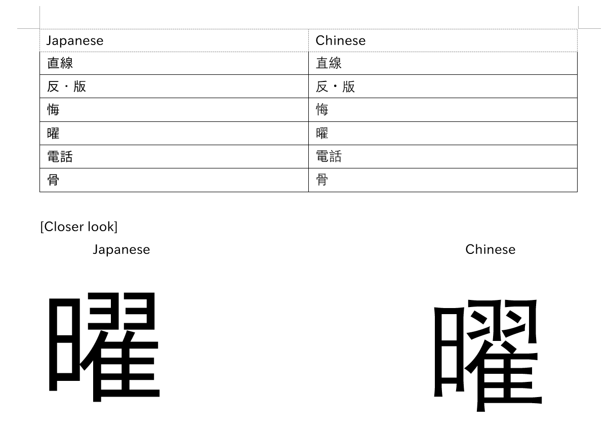

# Are you using the right font? 



By default, your computer / phone will display kanji in a Chinese font. Japanese kanji look slightly different, and it can look offputting to experienced learners when you are seen with a Chinese font.  

**Verifying if your browser is currently using a Japanese font**

The one character that looks strikingly different between Japanese and Chinese fonts is [直](https://jisho.org/search/%E7%9B%B4%20%23kanji) which is used in the word [直す](https://jpdb.io/search?q=%E7%9B%B4%E3%81%99) (*naosu*) which means *cure, heal, fix*.  

<figure>
  
  <figcaption>Naosu in a Chinese font (DengXian)</figcaption>
</figure>


<figure>
  
  <figcaption>Naosu in a Japanese font (IPAex Gothic)</figcaption>
</figure>

If your 直 looks like the second image, congrats! You are using a Japanese font, if not, change your font.  

## Windows 10

++win+i++ to open **Settings** > **Apps** > **Optional features** > **Add a feature** > Search **"Japanese supplemental fonts"** and **Install**  

Now if you're using a Chromium based browser (e.g. Google Chrome, Brave), click the Menu :material-dots-vertical: > **Settings** > click on **Appearance** on the left > **Customize fonts**. Here's where you'll need to set your fonts.  

Standard font: Meiryo UI  
Serif font: Yu Mincho  
Sans-serif font: Meiryo	  
Monospace: MS Gothic   

If you're using Firefox it is already pre-configured. 

## macOS

If you're using a Chromium based browser (e.g. Google Chrome, Brave), click the Menu :material-dots-vertical: > **Settings** > click on **Appearance** on the left > **Customize fonts**. Here's where you'll need to set your fonts.  

Standard font: Hiragino Kaku Gothic Pro  
Sans-serif font: Hiragino Kaku Gothic Pro  

## Linux

Install `noto-fonts-cjk` package then

:material-dots-vertical: > **Settings** > click on **Appearance** on the left > **Customize fonts**

Standard font: Noto Sans CJK JP Regular  
Serif font: Noto Serif CJK JP Regular  
Sans-serif font: Noto Sans CJK JP Regular  

## Android

Just add Japanese (it looks like this: 日本語) as a secondary language, it won't change your display language unless you move it to the top.  

## iOS

Adding the Japanese keyboard (kana or romaji whatever works) should do the trick.  

## Anki

I think Chinese font in Anki cards looks the worst as kana will be sans-serif and kanji will be serif AND out of proportion AND Chinese so it looks all out of place.

<figure>
  
  <figcaption>Oh god. Unironically a lot of people's cards look like this.</figcaption>
</figure>


After you have installed Japanese fonts on your system it *should* automatically use Japanese fonts. If not, you will need to force it.  

### Forcing Japanese font in Anki   

IPAex Gothic is a good sans-serif Japanese font I recommend for Anki. You can download it [here](https://moji.or.jp/wp-content/ipafont/IPAexfont/ipaexg00401.zip)  

Install the font onto your system and reboot.  

Windows: Double click and click Install  
macOS: Drag the font into the Font Book  
Linux: Google is your friend.  

Now in Anki click "Add" then click on "Cards" and then "Styling" and modify your font family accordingly.  

```css
.card {
 font-family: IPAexGothic; /* here is where you set font */
}
```

You can also change the font by putting the font into the Anki collection.media directory.  

Windows: `C:\Users\<user>\AppData\Roaming\Anki2\(profile)\collection.media`  
macOS: ` ~/Library/Application Support/Anki2/(profile)/collection.media`  
Linux: `~/.local/share/Anki2/(profile)/collection.media`  
Android: `/storage/emulated/0/AnkiDroid/collection.media`  

Now in Anki click "Add" then click on "Cards" and then "Styling" and modify your font family accordingly.  

```css
.card {
 font-family: CustomFont; /* here is where you set font */

 @font-face { 
 	font-family: CustomFont; src: url('ipaexg.ttf'); } /* here is where you define the font */

}  
```

Preview:

<figure>
  
  <figcaption>With a full Japanese definition.</figcaption>
</figure>

<figure>
  
  <figcaption>With a bilingual definition.</figcaption>
</figure>

Now also change your font for the Anki *editor*. Click on "Add" then "Fields" and change the Editing font to any one of these (or any other font you know is a Japanese font)

IPAexGothic  
Meiryo  
MS Gothic  
Yu Gothic  
Hiragino Kaku Gothic Pro  
Noto Sans CJK JP Regular  

## Yomichan 

Yomichan's font should change according to your browser's font, but you can force Japanese font if not.   

Using Popup CSS...

```css
.kanji-link {
   font-family: IPAexGothic;
}

.source-text {
   font-family: IPAexGothic;
}

.gloss-content {
   font-family: IPAexGothic;
}

.tag-label-content {
   font-family: IPAexGothic;
}
```  


<figure>
  
  <figcaption>Japanese to Japanese defintion with IPAexゴシック font.</figcaption>
</figure>


