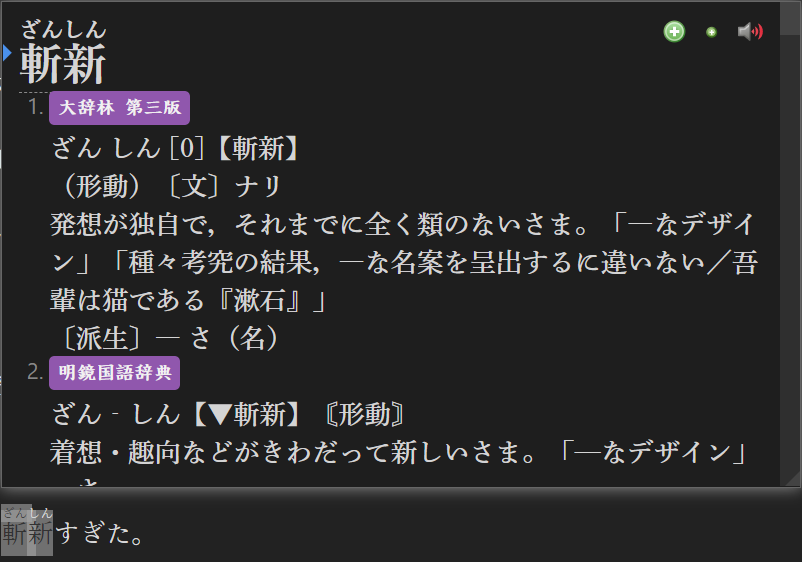
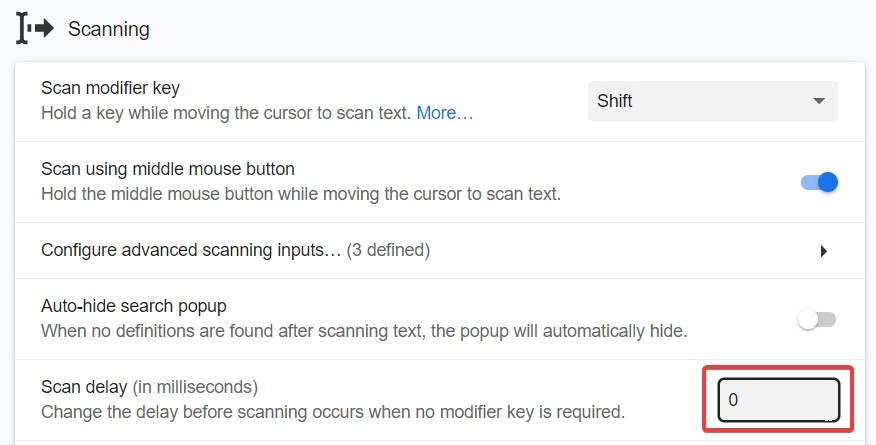
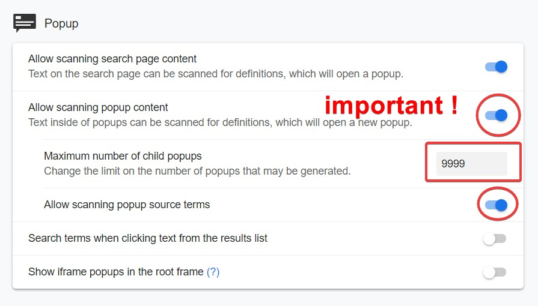
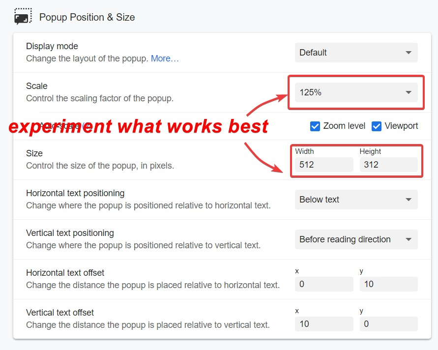
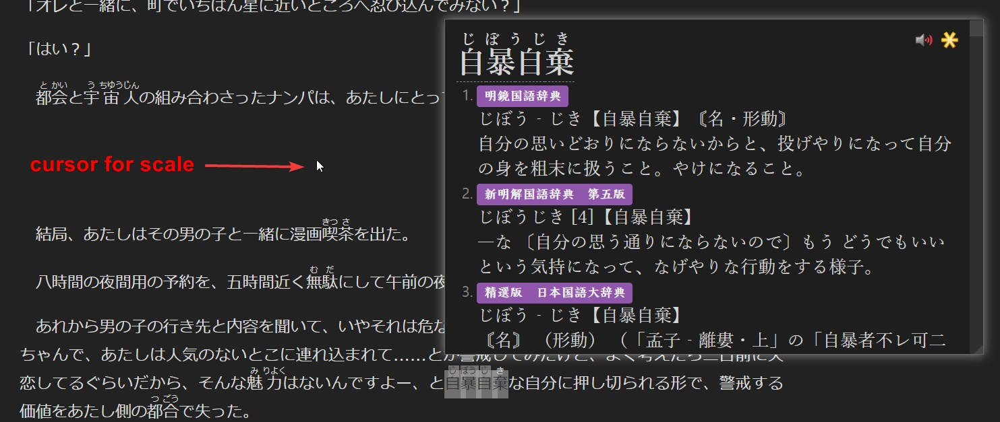
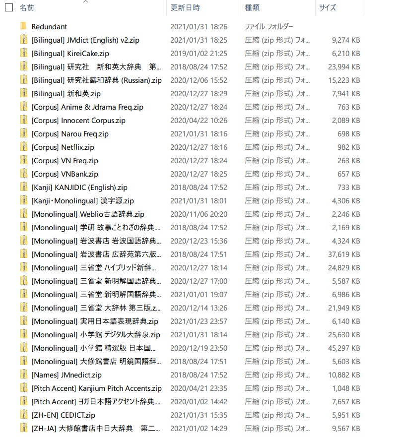

# Monolingual Guide  

!!! info "Intermediate Learners"
	This is a guide targeted at "intermediate" learners.

This guide will go through what the monolingual transition is and why you should do it, different mediums to access monolingual dictionaries and also ways to approach getting used to monolingual dictionaries. 
This guide is **long.** But it is still simple, it’s just the initial setup that just feels long.

### What is the monolingual transition

The monolingual transition is when you “transition" into getting used to a monolingual dictionary, often with the help of a bilingual dictionary as an aid. A monolingual dictionary is a dictionary that defines words of the language in that language. For example, the Oxford Dictionary is a monolingual English dictionary. The Kōjien (広辞苑) is a monolingual Japanese dictionary.
Sites such as Jisho.org use the Japanese-English *bilingual* dictionary known as “JMdict (English)”. Jisho.org is not its own dictionary, it is only a portal that accesses JMdict. So keep that in mind.

### Why you should use a monolingual dictionary
Monolingual dictionaries help you avoid making false associations with words from your native language (probably English) to Japanese. You may think, oh, what if I’m not even English? If you don’t use a monolingual dictionary, then you will make false associations anyway, no matter what your native language is. What if I’m German and I use the Wadoku (Japanese-German bilingual dictionary)? Same thing. You will still have this problem. There is no language that can express Japanese better than Japanese itself.

### What exactly do you mean by “false associations”?
Bilingual definitions, 90% of the time are very vague, and do not capture the true feeling of the word. You may not think so, but I’ve been using monolingual dictionaries for a long time now and I can confirm bilingual definitions (especially those from the JMdict) do not capture the true feel of the word.
Here’s an example: 
> 悔しい [くやしい]  

If you have been learning Japanese for a few months, you would know this word. And chances are you learned it using a bilingual dictionary. Let’s look at the bilingual definition.

> vexing; annoying  

You may think, “what’s wrong with it?” I’ll tell you what’s wrong with it. It’s so vague to the point that it is literally wrong. Now let’s look at the monolingual definition.

*Taken from the Hybrid Shinjirin (ハイブリッド新辞林)*

> 失敗や恥辱を経験して，あきらめたり忘れたりできないさま。

My translation of the definition:

> Go through failure and dishonour and not being able to give up nor forget (about it).

*And this gets less accurate when you put it into English.*

Did you get that from “vexing, annoying”? No. Probably not.

Not convinced? Let’s go through another example.
> 悪い [わるい]

Let me ask you one thing. What do you think this word means? If you answered, “bad”. Then you’re only half wrong. This word is not equal to the English word “bad”.

You can’t use 悪い to say that your skill at something is inferior/poor, like you can in English. You use a completely different word in Japanese, and that’s 下手 [へた]. See? And this is only scratching the surface of this problem.

The other reason why you should use monolingual definitions is because they help you think in Japanese. Like I said before, there is no language that can express Japanese as well as Japanese itself can. Dictionary definitions are a way of thinking about words. I’m sure dictionary authors (who are native speakers) put thought into each of their definitions when they wrote their definition, so by reading the definition and memorising it, you will have something *at least close* to what a native speaker may think of the word. If you learn words using a Japanese-English bilingual dictionary (such as JMdict) then you will have a GAIJIN way of thinking about things, and not even close to what a native may think about the word. This will set you back in getting a true understanding of the word. Don’t get me wrong, you can still get a true understanding with immersion, it just takes a lot longer than if you learned those words monolingually.

Monolingual dictionaries are very powerful, and you will only realise this once they become second nature to you.

### Why people find it hard to go monolingual.
Two reasons:  

- They don’t know the words.  
- Are not used to the written Japanese.

### Monolingual transition myths

- A profound belief that "dictionary vocabulary" exist. Primarily due to poor wording by Matt.  
  
**The truth:** “Dictionary vocabulary” = words you don’t know because you don’t read enough.

Hey shoui, are you also going to say that 体言 and 終止形 are also “common words”? Yes. You are only asking me this because you looked up “を” and other particles in the monolingual dictionary. They appeared because you asked them to. They are linguistic words so they need to be used to explain grammar, that’s it. Where else do you hear stuff like “passive form” and “nominalization” outside of language learning websites? Exactly. 99% of dictionary definitions don’t use that linguistic jargon, except for maybe 打ち消し (I’ve heard this in anime by the way so you need to know it). I’ve seen 終止形 used in a Twitter account that posts about Japanese grammar/linguistics by the way, so it is common when you look at Japanese grammar in Japanese :wink:  
There is no such thing as dictionary vocabulary, you are only seeing words such as 山岳, 器量 etc. because you asked them to. どうせ these are common words anyway.  

### Using Morphman to assist the monolingual transition
No.

Morphman is an Anki addon (?) which automatically decides what words to add to Anki for you. And for that reason it is a failure. Don’t leave it up to a silly computer program to help you decide what to add to Anki. Also most of what Morphman decides what to add for you is like “フゥ...”, “(♪～)”, “あっ...” so unless you’re into that I advise you to avoid using Morphman.  
If you want guidelines on what to mine, then just mine every single word after you have read/watched it. The idea here is, when you are looking up stuff, it is inevitable you are going to remember some things but forget others, so when you go back and read/watch it again, you mine all the words you failed to remember the first time. You may think, “I probably don’t need those words though”. Wrong. Yes you do. You need every word that comes up in your immersion.

## Yomichan - the better way to go monolingual.  

**I recommend doing the monolingual transition with Yomichan.**  

Yomichan is a browser extension that allows you to look up Japanese words on a webpage by holding ++shift++ and hovering over it. It is supported by any Chromium or Firefox based browser. You can find out how to set up Yomichan [here](/yomichan)  

### Optimizing Yomichan Settings 

First you need to ensure that Advanced options is enabled.  

Second, we want to remove any and all scan delays because we will be making heavy use of this extension and wouldn't want to be slowed down by anything.  

Now we will enable scanning within pop-ups, this is very important, as we want to be able to look up any words we don't know within a **definiton.**  
  

You may want to increase the size of your Yomichan pop up window because by default it is pretty small and will become a hindrance when using monolingual dictionaries. To make enough headroom to use Yomichan dictionaries comfortably we are going to edit the following settings.  

  

Here's how our pop up looks now:  
 

Next, if you want, you don't need to but I recommend it, enable automatic audio playback, so we know how to pronounce a word correctly the moment we look it up. Also add the extra audio source because surprisingly it adds extra audio!  

**Update 2021:** You can now add the Forvo audio source in Yomichan. See [Yomichan Setup Tutorial](/yomichan) for more info.  

  

I will touch on dictionaries in the next section.  

### Getting and using monolingual dictionaries

Again, I recommend you use monolingual dictionaries with Yomichan. I will talk about alternatives later.
Download [shoui Yomichan Dictionaries pack v5](https://drive.google.com/file/d/1t_y_MbyjEDkAkcvJlHZxlSJ5rAM6kvVu/view?usp=sharing)

Extract the .7z file (You can use [7-Zip](https://www.7-zip.org/) for this), and you will be greeted with some .zip files. 
**Do not tamper with these.**

    
 
These are our Yomichan dictionaries. No you don't need to import all of them.
 
Before we continue, have a read on recommended dictionaries and what they are exactly. 

### Recommended Dictionaries

#### Here’s what I recommend for first time monolingual users:

明鏡国語辞典  
ハイブリッド新辞林  
実用日本語表現辞典  
新明解国語辞典 第五版    
JMdict (English)  
研究社 新和英大辞典 第５版  
デジタル大辞泉      
KireiCake        

#### For general, 100% monolingual coverage:  

大辞林 第三版  
実用日本語表現辞典  
デジタル大辞泉  
新明解国語辞典 第五版  
新明解国語辞典 第七版   
明鏡国語辞典  
精選版 日本国語大辞典    
岩波国語辞典  
広辞苑 第六版  
故事ことわざの辞典  
漢字源  
  
### Every Dictionary Explained.

#### Monolingual

**大修館書店 明鏡国語辞典** - 1st edition of Meikyou. Concise and compact. Has expressions and always uses easy language. #1 recommended for first time monolingual users. Best for definitions on Anki cards. Second smallest. However, the current version we have has around 140 未収録語 but I have the source for the full version, will get it converted soon.  

**三省堂 新明解国語辞典 第七版** - 7th edition of Shinmeikai. Very verbose and precise with their definitions, always uses easy language, written from the ground up, instead of being based on old Meiji era dictionaries like the rest. However the definitions can get convoluted and confusing for most people. This is the smallest dictionary. 7th edition has weird formatting so I kept the 5th edition in the pack, I recommend you use the 5th edition instead to not clutter your Yomichan. Will be fixed soon. 	

**三省堂 ハイブリッド新辞林** - Daijirin's little sister, Shinjirin. The best thing about it is its concise definitions and how it has separate entries for different kanji variants like 撃つ vs 打つ. Highly recommended for beginners. 

**三省堂 大辞林 第三版** - 3rd edition of Daijirin. One of the bigger dictionaries, a great all rounder and my personal top dictionary.  Has names such as place names, common names and famous people too. The only thing I don't like it about it is that it can get unnecessarily scientific. I would put this next to Daijisen.  

**小学館 デジタル大辞泉** - "Digital Daijisen" - The KING of online dictionaries, now in Yomichan. It has an extra 120,000 entries over the original Dajisen. If you are using animecards.site's handlebars.js, I recommend you do not put this as your topmost dictionary as the first definition will get cut out when sent to the Anki card. Working on a fix.  

**岩波書店 広辞苑 第六版** - 6th edition of Koujien, the most authoritative dictionary in Japan. Language is a bit on the trickier side for beginners. It is one of the bigger dictionaries, but not in a way useful to most people, as it is best suited for 和語・漢語 and 固有名詞. Definitions are ordered by oldest to newest and are usually boring. This dictionary has a certain charm I like though.   

**岩波書店 岩波国語辞典** - 6th edition of Iwanami dictionary. This is the dictionary Google uses when you search "〇〇 定義"、"〇〇 定義"とは、 and/or "〇〇 意味". The definitions "[feel like the Meikyou](/img/iwakoku.jpg)".  

**精選版 日本国語大辞典** - "Seisenban" - The biggest digital Japanese dictionary to date. It has a heavy emphasis on classical Japanese, example sentences are like 500 years old and can appear to look crazy difficult, but it really comes through when you look up a word that's only in this dictionary. Keep it enabled to fill in gaps.  

**実用日本語表現辞典** - Lets call this Jitsuyou. This is one of the dictionaries Weblio uses, and whatever gap was still left after all the dictionaries above, will be filled in with this dictionary. Very useful, it's at the bottom of my order because it's only needed when the other dictionaries don't have a word.  

**故事ことわざ辞典** - a proverbs dictionary. Optional. But came in handy, I like it!   

**Weblio古語辞典** - archaism dictionary Weblio uses. Very optional.  

**漢字源** - monolingual kanji dictionary with some very rare words too. Keep if you want to mine individual kanji. 熟語 listings can not be found in the Yomichan version but the 熟語 themselves are still present if you look them up. There is a 1% chance this dictionary will be useful to you.  
 
#### Bilingual

**JMdict (English)** - The dictionary Jisho.org uses. This is the most popular bilingual dictionary and you have already probably used it. Pretty much every Japanese-English dictionary project uses JMDict, apps like Shirabe Jisho on iOS, Akebi and Takoboto on Android all use JMDict. The biggest flaw of this dictionary (apart from it being bilingual) is how it has no example sentences.

**KireiCake** - Based on an older version of JMDict but includes extra entries for slang. You may often see duplicate entries when used in tandem with JMDict, but for the entries that are exclusive to KireiCake, you should keep it.  

**研究社 新和英大辞典 第５版** - Kenkyuusha New Japanese-English Dictionary, 5th Edition, a Japanese-English dictionary intended for Japanese people. It has many example sentences which can prove to be very useful for Japanese learners. Better than JMDict.  

**新和英** - Version of 研究社 新和英大辞典 第５版 without example sentences. Not recommended.  

**研究社露和辞典** - Kenkyuusha Russian-Japanese Dictionary. Self explanatory. Only included this because why not. Do not import if you are not a speaker of Russian.  

**大修館書店 中日大辞典　第二版** - Taishuukan Chinese-Japanese Dictionary, 2nd edition. A simplified Chinese dictionary for speakers of Japanese. If you are ever going to learn simplified Chinese, I recommend this. Do not import if not a learner of Chinese.  

#### Frequency Lists

**Anime & Jdrama Freq** - Frequency list from Anime & Jdrama. Goes up to 99,999.  

**BCCJW** - Balanced Corpus of Contemporary Written Japanese. The kotonoha corpus. The biggest frequency list. Goes up to like 500,000.  

**Narou Freq** - Frequency list made from web novels from the 小説家になろう website. Goes up to 50,000 or so.  

**VN Freq v2** - Frequency list from visual novels. Goes up to 30,000.  

**Netflix** - Frequency list from Netflix subtitles. Goes up to 120,000  

**Wikipedia** - Borked supposed wikipedia frequency list. Whoever made this did not realize that there is more data than just 20,000.   

#### To be added  

**[Freq] InnocentRanked** - Ranked version of Innocent Corpus that behaves like a frequency list.  

### Continuation: Getting and using monolingual dictionaries  

Let's continue. 
Import the set of dictionaries that best suits you in [Recommended Dictionaries](#recommended-dictionaries).  

※ You can change dictionary priority so you can match the order by editing the number next to the dictionary. Higher the number = higher up in list.

  

### Why do you say use a lot of dictionaries?

You need to have a lot of dictionaries and have every one of them enabled because there will always be some words that are in some dictionaries and not in others. Take for example 禿同, that is only in 実用日本語表現辞典, and 院試, which is only in 日本国語大辞典. We want to use monolingual dictionaries as much as possible here. Another reason is that different dictionaries will describe a word in a different way, and in many cases you may not understand one dictionary's definition, but understand another.  

!!! question "But you would have to do a lot of scrolling to get to the next word?" 
	You should use the keyboard shortcut ++alt+down++  

## Alternatives

### Online Dictionaries

[Sakura-Paris Kojien Free Search](https://sakura-paris.org/dict/)

This site has **all** the major dictionaries, for free and online. You can’t view all the definitions at the same time though.  

Weblio: <https://www.weblio.jp/> (Uses 大辞林 第三版, 実用日本語表現辞典)

Goo: <https://dictionary.goo.ne.jp/> (Uses デジタル大辞泉)

Kotobank: <https://kotobank.jp/> (Uses デジタル大辞泉、大辞林 第三版 and 精選版 日本国語大辞典) 

Google: search “[word] 意味” e.g. “侮る 意味” (Uses 岩波国語辞典)
  
### Offline Alternatives

You’re gonna be learning Japanese for a long time, so it is possible that your internet may go out when you’re tryna nihongo grind! So you’re basically screwed right? Nope! 

*You download anime right…?*

### Yomichan Offline
You can still use Yomichan offline. Here’s how.

That’s how.

### Digital Dictionary Formats

You can see:  

[Japanese MDict (MDX) Dictionaries](https://learnjapanese.moe/resources/#mdict-mdx) - newer, open source, up to date and lower in size. Encoded in UTF-8 which is a nice bonus for anyone wanting to convert these to other formats.  

[Japanese EPWING Dictionaries](https://learnjapanese.moe/resources/#epwing) - old, extremely esoteric but popular in 電子辞書's from the 90's. Some are 
extremely bloated in file size. Encoded in EUC-JP which is a big spit in the face for anyone wanting to do any conversion with them.  

### Mobile  

If you are using Android, you can download [EBPocket](https://learnjapanese.moe/resources/#android), and load [EPWING](https://learnjapanese.moe/resources/#epwing) or [MDict](https://learnjapanese.moe/resources/#mdict-mdx) dictionaries into the app.  
[Typhon Reader](https://learnjapanese.moe/resources/#android) is a great ebook reader for Japanese learners that supports [EPWING](https://learnjapanese.moe/resources/#epwing) dictionaries.  

If you are using iOS, you can download [EBPocket](https://learnjapanese.moe/resources/ios), and load [EPWING](https://learnjapanese.moe/resources/#epwing) or [MDict](https://learnjapanese.moe/resources/#mdict-mdx) dictionaries into the app using iTunes.  

## Approaching Monolingual Dictionaries

There’s a few ways to approach getting used to monolingual dictionaries. I’ll go through each one of them.

Primarily in the AJATT community, there’s this one piece of advice:

### The “Throw away the bilingual dictionary forever, and start using the monolingual dictionary straight away!” Approach  

This is something Khatzumoto of AJATT proposed.  

I mean, if you read novels, this may be a pretty good approach, because you will already be familiar with the words, because novels generally just have more words than anime and manga. If you only watch anime and read manga, this may prove to be quite frustrating. When this piece of advice was put out, Yomichan didn’t exist. So people in that time would have found this piece of advice terrible and tiring to constantly look up everything in the definitions.  

This isn’t a fundamentally flawed approach, I think it’s pretty good how it says “just read the dictionary more!”, because that’s exactly what you need to do. 

I just disagree with throwing away the bilingual dictionary completely, because you still need it in the beginning of the monolingual transition. 

### The Morphman Approach
no  

### What you SHOULD do

How did I learn how to be comfortable with monolingual dictionaries? I read more. (novels, light novels, visual novels)  

When I read more novels I got more used to written Japanese, and when I looked up words, they were in monolingual, so when I learned more words, I got better at using the monolingual dictionary. Huh? Yeah. It’s really that simple. Read more. Read the novel more = reading the dictionary more because you need a dictionary to read novels :)

### >What did you do when you came across a word you didn’t know in the definition?

I looked it up with Yomichan. I tried reading the monolingual definition. If there were too many words I didn’t know in the definition, I just looked at the English definition (as a last resort) and moved on. You just need to keep doing this. REPETITION.   
Read more books. You will get comfortable with the monolingual dictionary if you just read a lot. Yes. Read more. Read a lot. That’s all there is to it.  Yomichan just makes the process easier, you don’t waste your energy manually searching, instead your energy goes into actually reading. That’s why I recommend using Yomichan.

### >Soo… what’s the best way to approach monolingual?

Read more novels with a monolingual dictionary. I recommend reading novels on [Itazuraneko](https://itazuraneko.neocities.org/library/shousetu.html) using Yomichan.  

### >What if I don't like reading novels? I hate reading novels!  

Find something you like. It can be a light novel or visual novel too you know. I "hate" novels in English, I have never tried to read more than 1 page of them, why do I "hate" them? Because I haven't experienced how good they actually might be, and I don't care really. But in Japanese, not only am I better at reading novels in Japanese, I also really enjoy reading novels in this language, I can't say the same for English. So even though you may despise novels in whatever your native language is, if you give it a shot (it will be difficult at first, as is everything), you may find yourself actually enjoying reading novels.  

### >shoui have you completely 卒業'd the bilingual dictionary?

Yes indeed. I haven't used the JMdict or anything since last year. 

### >But wouldn’t I be reading the dictionary more than the actual novel?

So what? It’s good that you are reading the dictionary more. Think of the dictionary as something FUN. 
It's fascinating in its own right.  

  

#### 10 Important Tips and Tricks

(壱). Read at least 1 novel (it can be a light novel or visual novel) before going monolingual.

(弐). Try to experiment with what dictionary order is the best for you.

(参). If the word you look up with Yomichan is only in a bilingual dictionary, try doing a kana search for it, or a full kanji search (Alt+Insert to get to the Yomichan search page)  

(肆). If you don’t understand the definition even if you looked up all the words, just look at/use the bilingual definition (last resort). You will get better at understanding when you use it more.

(伍). It is okay to check the bilingual definition to check that you’re getting the right basic idea.

(陸). Don’t worry about how much time it will take to “transition”

(漆). For monolingual Anki cards, just try to remember the gist of the definition. I tried to demonstrate this in [Japanese FAQ](/faq)  

(捌). Try to look up words you already know, in the monolingual dictionary, this is just to try to get accustomed to the dictionary at first hand.

(玖). Forget looking up very concrete nouns such as animals in the monolingual dictionary, you are better off just using Google Images instead.

(拾). Don’t overdo yourself! If it's too hard, try to use the bilingual dictionary until you feel confident again!

Have fun immersing!

<h3>Found this useful? Consider supporting me on Patreon!</h3>   

[:fontawesome-brands-patreon: Support me on Patreon](https://www.patreon.com/shoui){: .md-button } 

#### Walkthrough  

Need help with monolingual definitions? Not sure what all the symbols mean? I have written a guide for my Patreon. (Basic tier and over)  

[:fontawesome-brands-patreon: Support me on Patreon](https://www.patreon.com/shoui){: .md-button }

