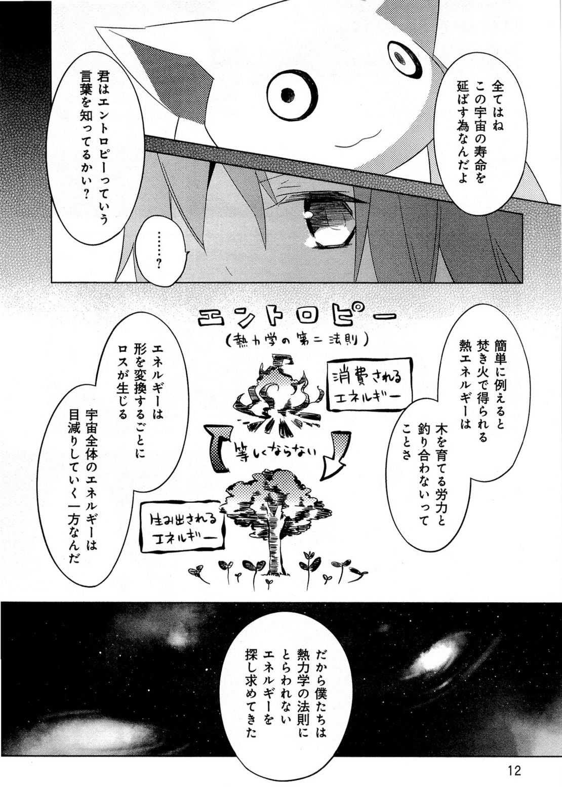
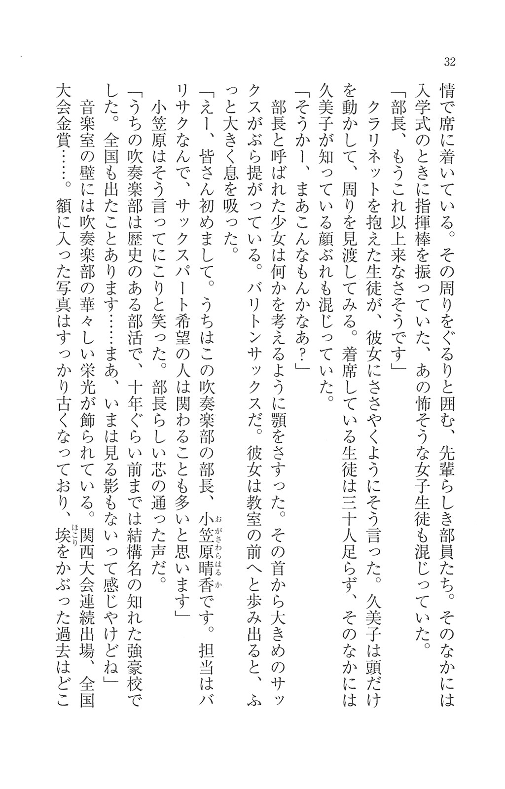
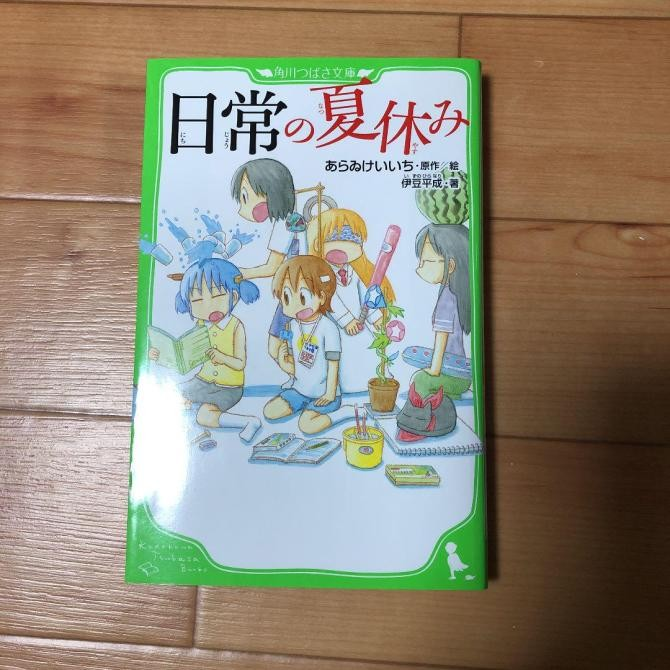
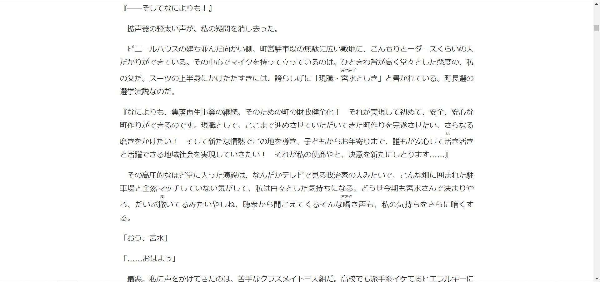

# Getting into Reading

Reading Japanese is ***CRUCIAL***. It is important you learn how to read Japanese. Often you get people asking "Well can I learn Japanese without learning how to read it?". You can, provided you don't want to understand basic grammar and have a tiny vocabulary size after years of study.  

With that said, it may seem difficult to learn how to read, after all there are like 3000 unique kanji on the page! Well yes, reading for the first time will always be painful, you just have to get through it and over time you will become more confident and better at reading. And if anyone is curious on how on earth you're supposed to look up Japanese words in a dictionary, just read on, there are certain tools that let you do this easily.  

Before you start reading for real, it is important you have already worked through a pre-made Anki deck, such as Tango N5+N4 *or* Core3k and also a grammar guide such as Tae Kim or Cure Dolly, this is to make the process less painful as there will be more words you know. Second, I recommend also having prior listening immersion experience because 1. it prevents you from developing a bad accent and 2. it helps you parse sentences better when reading.   

### Key Points  

1. Learning to read will always be painful in the start. You shouldn't wait "until you're ready" because you will never be ready until you start reading.  
2. It is not recommended you start reading without prior listening experience.  
3. Don't worry about not comprehending a sentence no matter how many times you read it, in other words, learn to **tolerate ambiguity**. Things will become clearer as you read more. 
4. If you hate reading books in general, you can always play visual novels or read manga, both of which are very good for reading. 
6. Your first light novel/book whatever will always be the most painful. Get through it no matter how painful it is or how long is takes you. 
7. Don't rush yourself. Take your time. Go at your own pace. You wouldn't want to burnout and end up never reading again or anything.

## Learning how to read 

As mentioned earlier, make sure you have an adequate vocabulary size and a grasp of Japanese grammar before reading, this will make things much easier.

### Japanese subtitles
Japanese subtitles are a good way to introduce yourself to reading, assuming you already understand a fine amount in raw, trying to read the subtitles can be good reading practice. However make them something quick to let go of and in the future only consider using Japanese subtitles for mining instead of for reading.

### Manga
Manga is probably the best way to get into reading without it being too intimidating as the way its written is similar to spoken Japanese, and assuming you're already quite familiar with that, it won't be much of a trouble getting used to.

*Manga: Mahou Shoujo Madoka Magica*

As you can see, manga uses all 3 writing systems, hiragana, katakana and kanji, therefore manga can be a great way to practice your skills in all 3 fields.
But how about looking up words? That's literally a scan isn't it?
Use the tool [KanjiTomo](http://www.kanjitomo.net/) and hover over the text, and it will automatically look it up, but it's a bit quirky and doesn't always work, in that case, you can use [Capture2text](http://capture2text.sourceforge.net/), set the OCR language to Japanese and highlight the text you want and it will copy it onto your clipboard, after that you can paste it into [Jisho](https://jisho.org/). It's actually quicker than it sounds. 

If Capture2Text fails, then use the Google Translate handwriting feature. No matter how badly you write the kanji, it will detect it. After that you can copy and paste it into Jisho.
Expect manga to be pretty hard for you at first, but over time it will smoothen out and get easier. You just need to read more. You just need to read a lot.

### Light Novels
Even if you read like 100 manga, you still need to read light novels since you need to learn literary Japanese.
Literary Japanese is not that hard as it sounds, it's only slightly different from spoken Japanese and will be easy to get used to.
For reading light novels, I recommend using *Yomichan*, you can find a detailed Yomichan setup tutorial [[here]](/yomichan)  
I seriously recommend you read novels on this site: [Itazuraneko Old Library](https://itazuraneko.neocities.org/shousetu/index.html), sort by kanji count, usually 1,000-1,600 kanji count is a good, this just means how long the book is if you actually look at it. If you have an Android you should use [Typhon Reader](https://play.google.com/store/apps/details?id=net.zorgblub.typhon&hl=ja) or [Typhon改](https://github.com/dajimenezja/typhon/releases) if the other one does not work with your phone. There are little buttons you can click on the itazuraneko old library to download epubs to load into it. You can also visit the [full epub list](https://yonde.itazuraneko.org/other/kensaku.html) but warning: you need a good phone to load that page because there are a LOT of books! If you cannot find the book you want on Itazuraneko you can try looking on [Boroboro](https://boroboro.neocities.org/listfullepub.html). iOS users can just use the Books app with epub files.

Your first light novel will be extremely painful, but your second light novel won't be as painful. Expect a light novel to take a month or so to finish reading when you're first starting out, it will get quicker overtime (I can finish a light novel in around 10 hours). Just read more, read a lot.  
Reading scans or physicals like these is not recommended.  
Note: I am not against 縦書き, (vertical), the image below is an example of a *scan*.  

*Novel: Hibike! Euphonium*

*Novel: Nichijou no Natsuyasumi*

You need to read stuff like this:

*Novel: Kimi no Na wa.*  
*Click to enlarge*

This is **digital**. Very important. I can select the text and use Yomichan with it.

###Visual Novels

*Visual Novel: Angel Beats! -1st beat-*

Visual Novels are very good if you hate reading books. It's helped supercharge my reading. It's similar to watching anime with Japanese subtitles. It is also good for making [AnimeCards](https://www.animecards.site) from and also serve as semi-listening semi-reading immersion. 
Make sure you have texthooking setup, you can find out how to do that [here](/vn).
To get good at reading visual novels, you just need to read more, you just need to read a lot

## Conclusion
Don't worry about how much "kanji" you "know". You can start reading after you have enough listening experience, and have finished a grammar guide or something. That's all. Don't hesitate. Don't feel like you're "not ready yet" because you will never be if you don't start reading.
Read more, read a lot, that's how you get good at reading.  No hacks, no tricks, sorry.

Have fun immersing! :smile:

