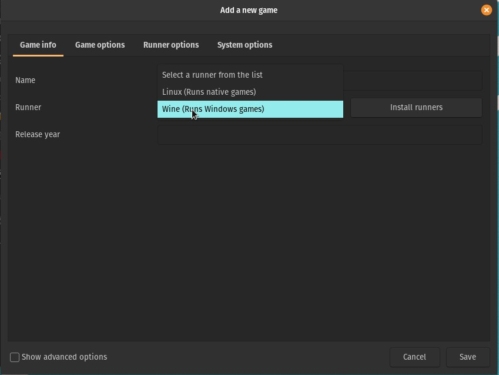
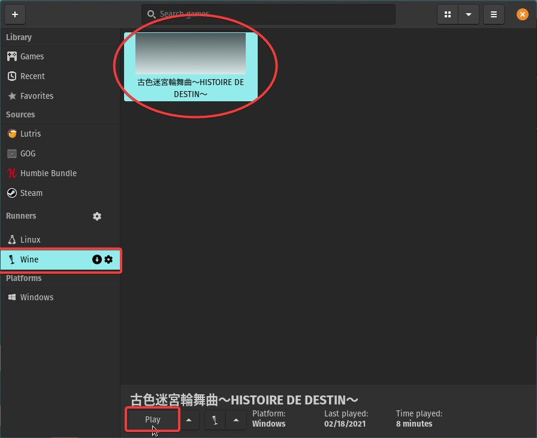
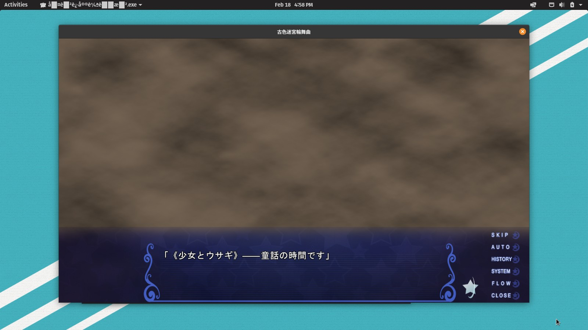

# Visual novels on Linux

Visual novels are only Microsoft Windows programs, therefore you must use Wine in order to run them. This works exceptionally well on Linux.  

Follow the steps below to run VNs on Linux. 

## Install Wine & Dependencies

=== "Arch"

	You will need to enable [multilib] and [community] before running this command. To do this, uncomment the `[multilib]` and `[community]` section in `/etc/pacman.conf`.

	```bash
	sudo pacman -S wine-staging winetricks lutris giflib lib32-giflib libpng lib32-libpng libldap lib32-libldap gnutls lib32-gnutls mpg123 lib32-mpg123 openal lib32-openal v4l-utils lib32-v4l-utils libpulse lib32-libpulse alsa-plugins lib32-alsa-plugins alsa-lib lib32-alsa-lib libjpeg-turbo lib32-libjpeg-turbo libxcomposite lib32-libxcomposite libxinerama lib32-libxinerama ncurses lib32-ncurses opencl-icd-loader lib32-opencl-icd-loader libxslt lib32-libxslt libva lib32-libva gtk3 lib32-gtk3 gst-plugins-base-libs lib32-gst-plugins-base-libs gst-plugins-good lib32-gst-plugins-good gst-plugins-bad gst-plugins-bad-libs gst-plugins-ugly libgudev vulkan-icd-loader lib32-vulkan-icd-loader cups samba dosbox
	```

	*This may look like a lot of "bloat" but for older games especially, you will need all of these.*  

	Now we might want something called *CDemu*, this is to trick some VNs into thinking that the original disc for the VN is inserted, so it'll let you play the game.  
	```bash
	sudo pacman -S cdemu-client cdemu-daemon
	```
	
	In order to use CDemu, you need to install the VHBA module.  
	```bash
	sudo pacman -S vhba-module
	```

	!!! info "Custom and LTS Kernels"
		If you are using a custom or LTS kernel, install `vhba-module-dkms`. Otherwise, install `vhba-module`.  

	The CDemu service is loaded with the kernel module.  

	If drivers for CD/DVD drives are not automatically loaded, you can load it manually.  
	```bash
	sudo modprobe -a sg sr_mod vhba
	```  

=== "Ubuntu"

	First you will need to enable 32-bit architecture.  
	```bash
	sudo dpkg --add-architecture i386
	```  
	Download the WineHQ repository key:  
	```bash
	wget -nc https://dl.winehq.org/wine-builds/winehq.key
	```  
	Now add the WineHQ repository key:  
	```bash
	sudo apt-key add winehq.key
	```  
	Add the repository:  

	```bash
	sudo add-apt-repository 'deb https://dl.winehq.org/wine-builds/ubuntu/ focal main' -y
	```
	!!! info "Other Ubuntu Versions"
		If you use a different version of Ubuntu you must do this instead. Replace `groovy` with the codename of the Ubuntu version you use. This one is for 20.10:
		```bash
		sudo add-apt-repository 'deb https://dl.winehq.org/wine-builds/ubuntu/ groovy main' -y
		```  
	Add PPA's for Lutris:  
	```bash
	sudo add-apt-repository ppa:lutris-team/lutris -y
	```

	Update packages:  
	```bash
	sudo apt update
	```
	Now install the stable version of Wine:  
	```bash
	sudo apt-get install --install-recommends winehq-stable -y
	```
	Now install Lutris, CDEmu and some needed libraries:  
	```bash
	sudo apt-get install lutris libgnutls30:i386 libldap-2.4-2:i386 libgpg-error0:i386 libxml2:i386 libasound2-plugins:i386 libsdl2-2.0-0:i386 libfreetype6:i386 libdbus-1-3:i386 libsqlite3-0:i386 libgstreamer-plugins-base1.0-0:i386 libgstreamer-plugins-good1.0-0:i386 libgstreamer-plugins-bad1.0-0:i386 libgudev-1.0-0:i386 ocl-icd-dev:i386 -y
	```
	Now we need to install `winetricks` manually because the one on the repository already is outdated and causes errors.  
	First, wget the binary:  
	```bash
	wget https://raw.githubusercontent.com/Winetricks/winetricks/master/src/winetricks
	```
	Use `chmod` to make it into an executable:  
	```bash
	chmod +x winetricks
	```
	Now copy it to your `/usr/bin` so it can be used in a command line.  
	```bash
	sudo cp winetricks /usr/bin
	```  
	
	Optionally, for some VNs, you might want *CDemu* which tricks VNs into thinking that the original disc is inserted so it'll let you play the game.  
	
	Add PPA's for CDEmu:  
	```bash
	sudo add-apt-repository ppa:cdemu/ppa -y
	```
	Update package repositories:  
	```bash
	sudo apt update
	```
	Now we need to install the VHBA module if you don't already have it.  
	```bash
	sudo apt-get install vhba-dkms -y
	```
	The CDemu service is loaded with the kernel module.  

=== "Debian"
	
	✅ Tested on Debian 11 Bullseye
	
	First you will need to enable 32-bit architecture.  
	```bash
	sudo dpkg --add-architecture i386
	```  
	Download the WineHQ repository key:  
	```bash
	wget -nc https://dl.winehq.org/wine-builds/winehq.key
	```  
	Now add the WineHQ repository key:  
	```bash
	sudo apt-key add winehq.key
	```  
	Add the WineHQ repository to your `/etc/apt/sources.list`:  
	
	`deb https://dl.winehq.org/wine-builds/debian/ bullseye main`  
	
	You will need the **Deb Multimedia** repository for CDEmu, this is used to trick VNs that the disc is inserted if no crack is available.
	Using `wget`, get its GPG keyring:
	```bash
	wget https://www.deb-multimedia.org/pool/main/d/deb-multimedia-keyring/deb-multimedia-keyring_2016.8.1_all.deb
	```
	Install the deb file as usual:
	```bash
	sudo dpkg -i deb-multimedia-keyring_2016.8.1_all.deb
	```
	Now add the repository to your `/etc/apt/sources.list`  
	
	`deb http://www.deb-multimedia.org bullseye main`  
	
	You also need to append `contrib` and `non-free` to your main repository line in `/etc/apt/sources.list` if you haven't done so already.    
	Example:  
	`deb http://deb.debian.org/debian bullseye main contrib non-free`  
	
	Now finally update package repositories:
	```bash
	sudo apt update
	```
	
	Now install all the needed packages, including Wine, Lutris, CDEmu and other Wine dependencies.
	```bash
	sudo apt install --install-recommends winehq-stable lutris dbus-x11 libmirage-plugins gcdemu cdemu-client cdemu-daemon libgnutls30:i386 libldap-2.4-2:i386 libgpg-error0:i386 libxml2:i386 libasound2-plugins:i386 libsdl2-2.0-0:i386 libfreetype6:i386 libdbus-1-3:i386 libsqlite3-0:i386 libgstreamer-plugins-base1.0-0:i386 gstreamer1.0-plugins-good:i386 libgstreamer-plugins-bad1.0-0:i386 libgudev-1.0-0:i386 ocl-icd-dev:i386 -y
	```  
	
	Now we need to install `winetricks` manually because the one on the repository already is outdated and causes errors.  
	First, wget the binary:  
	```bash
	wget https://raw.githubusercontent.com/Winetricks/winetricks/master/src/winetricks
	```
	Use `chmod` to make it into an executable:  
	```bash
	chmod +x winetricks
	```
	Now copy it to your `/usr/bin` so it can be used in a command line.  
	```bash
	sudo cp winetricks /usr/bin
	``` 
	In case you do not have the VHBA kernel module, get it now.  
	```bash
	sudo apt install vhba-dkms
	```
	The Cdemu service should be loaded with the kernel module.  

=== "Fedora"  

	First add the Wine repository.  

	Fedora 33:  
	```bash
	sudo dnf config-manager --add-repo https://dl.winehq.org/wine-builds/fedora/33/winehq.repo
	```
	Fedora 32:
	```bash
	sudo dnf config-manager --add-repo https://dl.winehq.org/wine-builds/fedora/32/winehq.repo
	```  

	Now lets install ALL the build dependencies.  

	```bash
	sudo dnf install alsa-plugins-pulseaudio.i686 glibc-devel.i686 glibc-devel libgcc.i686 libX11-devel.i686 freetype-devel.i686 libXcursor-devel.i686 libXi-devel.i686 libXext-devel.i686 libXxf86vm-devel.i686 libXrandr-devel.i686 libXinerama-devel.i686 mesa-libGLU-devel.i686 mesa-libOSMesa-devel.i686 libXrender-devel.i686 libpcap-devel.i686 ncurses-devel.i686 libzip-devel.i686 lcms2-devel.i686 zlib-devel.i686 libv4l-devel.i686 libgphoto2-devel.i686 cups-devel.i686 libxml2-devel.i686 openldap-devel.i686 libxslt-devel.i686 gnutls-devel.i686 libpng-devel.i686 flac-libs.i686 json-c.i686 libICE.i686 libSM.i686 libXtst.i686 libasyncns.i686 liberation-narrow-fonts.noarch libieee1284.i686 libogg.i686 libsndfile.i686 libuuid.i686 libva.i686 libvorbis.i686 libwayland-client.i686 libwayland-server.i686 llvm-libs.i686 mesa-dri-drivers.i686 mesa-filesystem.i686 mesa-libEGL.i686 mesa-libgbm.i686 nss-mdns.i686 ocl-icd.i686 pulseaudio-libs.i686 sane-backends-libs.i686 tcp_wrappers-libs.i686 unixODBC.i686 samba-common-tools.x86_64 samba-libs.x86_64 samba-winbind.x86_64 samba-winbind-clients.x86_64 samba-winbind-modules.x86_64 mesa-libGL-devel.i686 fontconfig-devel.i686 libXcomposite-devel.i686 libtiff-devel.i686 openal-soft-devel.i686 mesa-libOpenCL-devel.i686 opencl-utils-devel.i686 alsa-lib-devel.i686 gsm-devel.i686 libjpeg-turbo-devel.i686 pulseaudio-libs-devel.i686 pulseaudio-libs-devel gtk3-devel.i686 libattr-devel.i686 libva-devel.i686 libexif-devel.i686 libexif.i686 glib2-devel.i686 mpg123-devel.i686 mpg123-devel.x86_64 libcom_err-devel.i686 libcom_err-devel.x86_64 libFAudio-devel.i686 libFAudio-devel.x86_64
	```  

	```bash
	sudo dnf groupinstall "C Development Tools and Libraries"
	sudo dnf groupinstall "Development Tools"
	```
	You also need some packages from [rpmfusion](https://rpmfusion.org)  

	```bash
	sudo dnf install gstreamer-plugins-base-devel gstreamer-devel.i686 gstreamer.i686 gstreamer-plugins-base.i686 gstreamer-devel gstreamer1.i686 gstreamer1-devel gstreamer1-plugins-base-devel.i686 gstreamer-plugins-base.x86_64 gstreamer.x86_64 gstreamer1-devel.i686 gstreamer1-plugins-base-devel gstreamer-plugins-base-devel.i686 gstreamer-ffmpeg.i686 gstreamer1-plugins-bad-free-devel.i686 gstreamer1-plugins-bad-free-extras.i686 gstreamer1-plugins-good-extras.i686 gstreamer1-libav.i686 gstreamer1-plugins-bad-freeworld.i686
	```  

	Now install Wine:  

	```bash
	sudo dnf install wine
	```

	And then Winetricks:  

	First, wget the binary:  
	```bash
	wget https://raw.githubusercontent.com/Winetricks/winetricks/master/src/winetricks
	```
	Use `chmod` to make it into an executable:  
	```bash
	chmod +x winetricks
	```
	Now copy it to your `/usr/bin` so it can be used in a command line.  
	```bash
	sudo cp winetricks /usr/bin
	```  

	And now CDEmu, first enable the rok/cdemu COPR repository:  

	```bash
	sudo dnf copr enable rok/cdemu
	```
	Now install CDEmu daemon and clients:  

	```bash
	sudo dnf install cdemu-daemon cdemu-client gcdemu
	```

	Now load the VHBA kernel module:  
	```bash
	sudo akmods
	sudo systemctl restart systemd-modules-load.service
	```  

=== "openSUSE"  

	✅ Tested on openSUSE Tumbleweed 20210408 

	```bash
	sudo zypper install wine winetricks lutris cdemu-client cdemu-daemon gstreamer-plugins-good gstreamer-plugins-good-32bit gstreamer-plugins-base gstreamer-plugins-base-32bit gstreamer-plugins-libav gstreamer-plugins-libav-32bit gstreamer-plugins-bad gstreamer-plugins-bad-32bit gstreamer-plugins-ugly gstreamer-plugins-ugly-32bit libgudev-1_0-0 libgudev-1_0-0-32bit libSDL2-2_0-0 libjpeg-turbo
	```  
	Now load the VHBA module into your kernel.  

	```bash
	sudo modprobe -a sg sr_mod vhba
	```  

=== "Gentoo"

	Make sure your kernel is compiled with the following options enabled:

	* `CONFIG_BLK_DEV_SR`
	* `CONFIG_ISO9660_FS`
	* `CONFIG_UDF_FS`
	* `CONFIG_IA32_EMULATION` (for 32 bit support)
	
	and that you have a multilib setup.
	
	It is recommended to have the following global use flags in your `make.conf`:

	* `X`
	* `pulseaudio`
	* `jpeg`
	* `png`
	
	Refer to the gentoo wiki for more information on different verions of wine available on gentoo [here](https://wiki.gentoo.org/wiki/Wine). `wine-vanilla` should be able to run almost everything fine . Be sure that the flag `abi_x86_32` is not turned off FOR wine-vanilla (it's on by default), more info visit the wiki [here](https://wiki.gentoo.org/wiki/Wine#32-bit_vs_64-bit).
	
	Install the deps.
	```bash
	sudo emerge -v app-emulation/wine-vanilla virtual/wine games-util/lutris app-cdr/cdemu app-emulation/winetricks
	```
	
	Load the vhba module for cdemu
	```bash
	sudo modprobe vhba
	```

	To autoload the module on startup, edit your `/etc/conf.d/modules` file and add this line:

	```toml
	modules="vhba"
	```

	In order for the CDEmu daemon to be started automatically by the UI, you will need to have dbus enabled. You can enable it by running:

	```bash
	sudo rc-update add dbus default
	## or if systemd the default init
	sudo systemctl enable dbus
	```

## Configure Wine and install runtimes

### Creating the Wineprefix  

First we need to create a 32 bit Wine prefix, this has the best compatibility and 64 bit is unnecessary for VNs.

```bash
WINEPREFIX=~/.winevn WINEARCH=win32 wineboot
```  

### Using winetricks  

Now we need to install the common redistributables such as DirectX, Visual C++ Runtimes and .NET Framework 3.5 and other things that make video cutscenes work. 

!!! tip "Optional: Font smoothing"
	You can do `winetricks fontsmooth=rgb` because without it, the font is simply awful.  

!!! tip "Optional: GUI Improvments"
	You can open the Registry Editor using `wine regedit` and import [this .reg file](https://cdn.discordapp.com/attachments/813105334763126814/813105422285799464/wine_breeze_colors.reg), the GUI should look nice and clean then.  

First you need to get the latest patches for Winetricks or else this will not work. 

```bash
sudo winetricks --self-update
```
Now you can use Winetricks. 
```bash
WINEPREFIX=~/.winevn winetricks ffdshow quartz wmp9 d3dx9 dotnet35 vcrun2003 vcrun2005 vcrun2008 vcrun2010 vcrun2012 vcrun2013 vcrun2015
```  
!!! tip "ffdshow"
	When installing ffdshow, make sure you check (tick) ☑ every single codec/format or else it will not work!  
Installing DXVK slightly improves performance as it is a Vulkan implementation of D3DX9.  
```bash
WINEPREFIX=~/.winevn winetricks dxvk
```  
!!! warning "Vulkan Unsupported Systems"  
	If your system does not support Vulkan, do not install DXVK. If you want to remove DXVK, follow the instructions [here](https://github.com/doitsujin/dxvk)  
For some VNs, such as TYPE-MOON's, LAVFilters may be needed to playback video.  
```bash
WINEPREFIX=~/.winevn winetricks lavfilters
```  
!!! failure "ffdshow and LAVFilters"
	Some games may break if you have both ffdshow and LAVFilters installed! Make sure you experiment!  

Then, run this command to disable DLL overrides, and use the native DLLs instead:

```bash
WINEPREFIX=~/.winevn winetricks alldlls=default
```  
!!! question "Having issues?"	
	You can set it back using `winetricks alldlls=builtin`  

### Japanese fonts in Wine  

You need to install Japanese fonts to Wine now. Please download the pack below.  
[[Google Drive]](https://drive.google.com/file/d/1OiBgAmt3vPRu08gPpxFfzrtDgarBGszK/view?usp=drivesdk)  
Unzip the file and move the font files to your `Fonts` folder in `~/.winevn/drive_c/windows/Fonts`    

!!! question "Why not install `cjkfonts` in winetricks?"
	Because it doesn't work properly for VNs.  

## Lutris initial setup  

### Environment Variables  

Once thats done, we can setup Lutris.

Open Lutris, and click the plus icon in the top left corner, and click Install runners.


Scroll down to the bottom and find "Wine" and click the cog icon next to it.  

  

Now go to System options and set the environment variables as shown below and click Save.  

- Key: `LC_ALL`	Value: `ja_JP.UTF-8`  
- Key: `TZ`	Value: `Asia/Tokyo`   

!!! tip "Wine prefix in lutris"
	Forgot to include this so make sure you set the wine prefix in Lutris too.  
  

## Installing the visual novel  

I will be using 古色迷宮輪舞曲～HISTOIRE DE DESTIN～ for this demonstration. Visual Novels usually come in .ISO files and if not, an .MDS/.MDF file which can be mounted with `cdemu`.  

### Mounting disc images

Navigate to the path of the disc image:  
```bash
cd /path/to/visualnovelfolder
```
!!! info "MDS"
	Load the .MDS file with CDEmu first. The Linux `mount` command will not mount it.
	```bash
	cdemu load 0 /path/to/mds_image.MDS
	```  
!!! info "UDF Volumes"
	Load the UDF volume with CDEmu. The Linux `mount` command with the `-t udf` argument is not advised.  
	```bash
	cdemu load 0 /path/to/udf_volume
	```  
!!! question "CDEmu Mount Point?"  
	It should usually be in `/run/media/user/image_name`  

If using a regular ISO9660 ISO file create a mount point for it.
```bash
sudo mkdir -p /media/cdrom0
```
Now we can mount our ISO to our mount point.  
```bash
sudo mount -o loop file.ISO /media/cdrom0
```  
If all went well, you will be able to see the contents of the image by doing `ls /media/cdrom0` or whatever your mount point is:  

  

### Running the installer

!!! info "Localegen"
	Generate the ja_JP.UTF-8 locale first.

Next, we will run the setup file using `wine`:

```bash
LC_ALL="ja_JP.UTF-8" TZ="Asia/Tokyo" WINEPREFIX=~/.winevn wine <setup_executable>.exe
```
!!! info ".msi installer"
	If the installer executable is an .msi, run with `msiexec` instead of `wine`.  

Proceed with the installation. The game may be installed in `~/.winevn/drive_c/Program Files` or wherever you chose to install it.  

## Adding to Lutris

Now we can add the game to Lutris so we can launch it quickly.  

Back in Lutris, click the plus icon in the corner, add the name of the VN, choose Wine as the runner and under "Game Options" navigate to the game's executable. You should also change the prefix architecture to 32-bit.

  

!!! tip "AlphaROMdiE"
	For AlphaROMdiE, you need to add AlphaROMdiE to Lutris as the executable, and the filename .exe of the Visual Novel as an argument. If you are using Wine in a command line it should look something like this: 
	```bash
	LC_ALL="ja_JP.UTF-8" TZ="Asia/Tokyo" WINEPREFIX=~/.winevn  wine AlphaROMdiE.exe <VN_executable.exe>
	``` 
	For the 1st option, you must create an empty file `disable_conv` in the same location as AlphaROMdiE.exe, for the 3rd option, you must create an empty file `other_engine` in the same location as AlphaROMdiE.exe. You can do this easily by doing: 
	```bash
	touch disable_conv other_engine
	```
	
  

!!! warning "Vulkan Unsupported Systems"
	If your system does not support Vulkan, you must disable DXVK in "Runner options", this will fallback to regular D3DX9. DXVK is a Vulkan implementation of Direct3D so we will be keeping it on even though Vulkan may not make much of a difference.  

Now you can just launch it in Lutris!  

  

!!! failure "Error: オリジナルディスクを入れてください"
	Load the .ISO image with `cdemu`. Even though Linux can mount ISO9660 images without CDEmu, *Wine* programs cannot seem to find the mounted image.  
	```bash
	cdemu load 0 /path/to/image.ISO
	```

and viola!  



Now go back to [Visual Novel Guide](https://learnjapanese.moe/vn/#playing-visual-novels-to-learn-japanese) to learn how to use Textractor, it works perfectly under Wine. Also consider adding Textractor to Lutris for quick access.

## Linux: Troubleshooting

### Shift-JIS

When you've done everything correctly but your VN text still looks like this: ????? ?????????? ???????????? 
This means your VN needs to use ja_JP.sjis instead of ja_JP.UTF-8.  

You need to download ja_JP.sjis from [here](https://cdn.discordapp.com/attachments/813105334763126814/825472692558889022/ja_JP.sjis.zip) first.  

Extract it to a memorable location on your computer and `cd` into that directory.  

```bash
cd /path/to/ja_JP.sjis
```

Now compile the locale using `localedef`:
```bash
localedef -i ja_JP -f SHIFT_JIS ./ja_JP.sjis --no-warnings=ascii
```

Using your editor of choice, edit your locale.gen and add `ja_JP.SJIS SHIFT_JIS` after `ja_JP.UTF-8 UTF-8`

```bash
vim  /etc/locale.gen
```
Now generate locales:

```bash
locale-gen --no-warnings=ascii
```  

You can then change the `LC_ALL` environment variable in Lutris to `ja_JP.sjis`.  

### MPEG-1 movie does not play

!!! failure "No full fix found yet"
	I spent 20 hours trying to fix this issue (I use Arch btw) with a Liar-soft VN. If you manage to find a fix, please let me know!  
	??? info "Things I have tried that may work for other VNs"  
		- Installing every gstreamer plugin, including lib32 versions.  
		- Using different combinations of gstreamer plugins (e.g. ugly & bad or good & base)  
		- Launching the VN with the latest version of Proton-GE.  
		- winetricks=alldlls default will entirely skip the video (already covered in this guide)  
		- Using LAVFilters  
		- Enabling MPEG-1 decoder in ffdshow  
		- installing libgudev (including lib32 version)  
		- 64-bit Wine prefix  
		- installing gstreamer for Windows in wine  
		- installing `allcodecs` in winetricks  
		- installing wmp9, wmp10 and wmp11 and wmpcodecs  
		- replacing quartz.dll with quartz.dll 6.5.2600.5512 from Windows XP  
		- disabling winegstreamer.dll  
		Despite all of this, something simple as playing back a MPEG-1 video was not possible.  
		Using `gst-play-1.0` I am able to play the actual .mpg file just fine.  
		Here is the error related to MPEG-1 video playback I get in the Wine debugger:  
		```
		winegstreamer error: decodebin0: GStreamer はプラグインを見つけることができません
		0100:err:gstreamer:decodebin_parser_init_gst Failed to play stream.
		winegstreamer error: decodebin0: ../gst-plugins-base/gst/playback/gstdecodebin2.c(4719): gst_decode_bin_expose (): /GstBin:bin0/GstDecodeBin:decodebin0:
		no suitable plugins found:
		Missing decoder: MPEG-1 System Stream (video/mpeg, systemstream=(boolean)true, mpegversion=(int)1)
		```

### Fuguriya VNs

VNs made by Fuguriya such as *Sono Hanabira ni Kuchizuke o* and *Hanahira*  will not launch with Wine by default. Follow the steps below to fix this.  

Download fjfix [[here]](https://cdn.discordapp.com/attachments/813105334763126814/832650409167945798/fjfix.tar.gz).   
Extract the archive.   
Now in the terminal, run:  
```bash
LC_ALL=ja_JP.UTF-8 WINEPREFIX=~/.winevn wine fjfix.exe -f /path/to/MGD
```

Now it should just work.  


<h3>Found this useful? Consider supporting me on Patreon!</h3>   

[:fontawesome-brands-patreon: Support me on Patreon](https://www.patreon.com/shoui){: .md-button }
