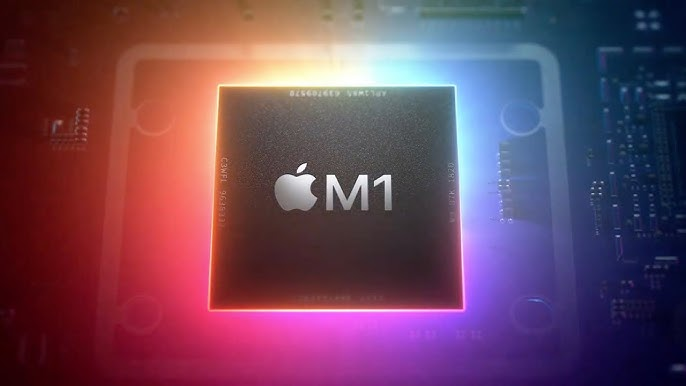
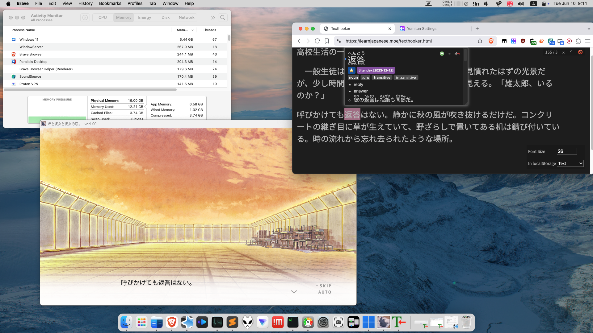

# Visual novels on macOS (Apple Silicon)
{:  style="display: block; margin: 0 auto; max-width:100%; height:auto;" }  
With major macOS updates getting released every year, and Apple fully completing the transition to Apple Silicon, it is getting harder and harder to use translation layers (such as Wine, Game Porting Toolkit 2, CrossOver etc.) to run Windows games on macOS.  
The only solution that works with the best compatibility, ease-of-use, and accuracy is running a **Windows 11 for Arm virtual machine under Parallels 20**.

## Running visual novels on your Mac

Here is a checklist of things you should do to run visual novels on your Mac:

- Install Parallels (at least version 20) on your Mac.  
- Install Windows 11 for Arm in Parallels. The automatic installer in Parallels works fine for this.  
- Set the Windows locale to Japanese. (see the [Windows guide](/vn-win) for instructions.)
- Set up the files to play your visual novel. (see the [Windows guide](/vn-win) for instructions.)  
- Enable Coherence Mode in Parallels for a seamless experience.  
- You are now ready to play visual novels on your Mac! Follow the [learning Japanese with VNs guide](/vn) for info on how to look up words.  

Caveats: **8GB RAM Macs are not recommended.** You may need a Mac with at least 16GB of RAM for a smooth experience.  

## Textractor

### Install Location
Please AVOID putting Textractor in your Mac shared folders (the blue folders). They will cause random issues and errors.  
I highly advise you put Textractor somewhere on your actual VM's C: drive: **This PC > Local Disk (C:) > Users > [user] > Desktop**.  

### Websockets don't work
Because port forwarding the websocket port to your Mac is unreliable, please avoid using websockets in Textractor.  
Instead, do the old fashioned way of using the "Copy to Clipboard" default Textractor extension and using a browser such as Brave or Firefox that still supports the "Clipboard Inserter" browser extension.    
The clipboard is shared between Mac and Windows by default on Parallels, so all you have to do is have the hook ready and set up.  
Then, have the Clipboard Inserter extension enabled on the [classic Texthooker page](/texthooker.html) and you'll be good to go.    

Alternatively, you could explore Japanese OCR options for macOS.  

## Tips for 8GB Mac users

### Limit the virtual machine to 4GB RAM
This is the minimum officially supported by Windows 11.
### Close out all applications you are not currently using
++cmd++++q++ quit applications you are not currently using so your system has more free memory to use.
### Use a bloat-free version of Windows 11
There is an official bloat-free version of Windows 11 for Arm known as **Windows 11 IoT Enterprise LTSC (Arm64)** and it is ideal for low resource usage.

## Legacy macOS with Intel Processors

You can still run VNs without a virtual machine with varying degrees of success on Intel Macs with Catalina or earlier by using Gcenx's Wine builds and installing packages within the Wine prefix to get DirectX 9 working.  
This method is free but does not have the same compatibility as using a virtual machine, so you should consider also using Parallels on your Intel Mac, the plus side is that you can use any Windows version you want, including Windows 7, which does not need that much RAM at all.