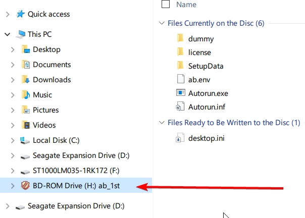
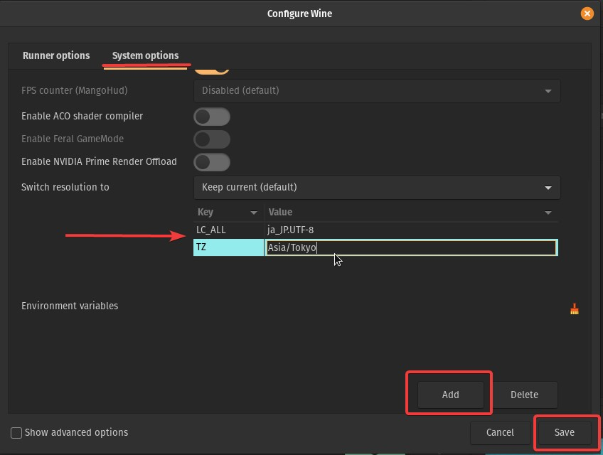
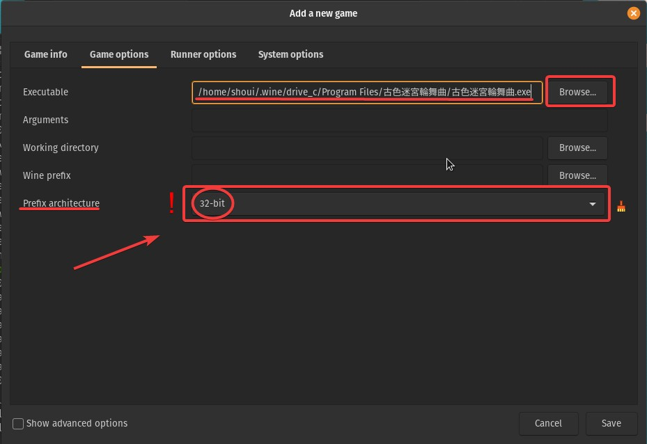
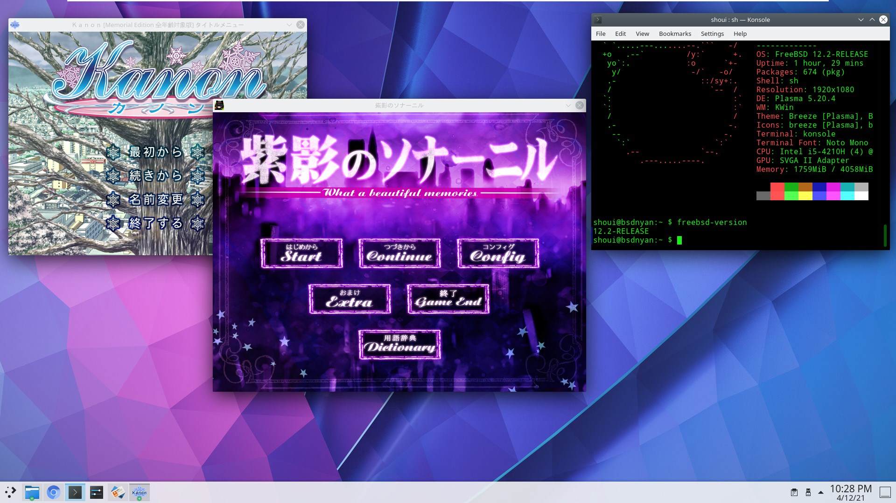
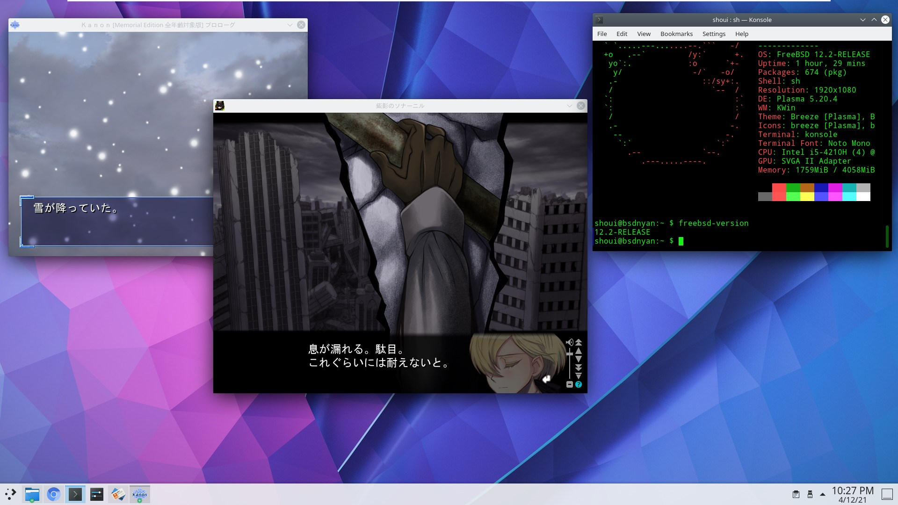

# Cross Platform Visual Novel Setup 

This page will go over how to set up visual novels on all platforms.  

## Getting Visual Novels

Check out the [Resources](/resources/#the-following-may-be-nsfw) page to find where to get Visual novels.

Visual novels for Microsoft Windows are distributed commonly in disc image files. Usually in .ISO and sometimes .MDF/.MDS files, or, these files but contained in a .rar/.zip/.7z file.

!!! question "Glossary: disc image file"
	A disc image file does not refer to a picture of a disc, rather it is a file (usually `.iso`) that contains an exact copy of what was on a disc. Remember: Japanese visual novels are sold on optical discs, and then people make an exact copy of what is on the disc onto an `.iso` or `.mdf/.mds` file.

## Microsoft Windows

Visual novels are always Microsoft Windows programs. If you have a Windows PC, you will always be able to run visual novels as long as your visual novel supports the Windows version you are running. For most VNs out there, Windows 7 is a minimum, older titles will also work on XP. Newer titles released after 2019 will require Windows 8.1 as a minimum.  

### Step 1. Japanese Locale

Japanese visual novels will not run without Japanese locale. Some may run, but have limited functionality, audio, visuals and saving may not work. Japanese locale is the minimum requirement for running Japanese games on your Windows PC. You may use a locale emulator, though it is less of a hassle to just change system-wide locale in my opinion.  

**Follow the steps below to set Japanese locale on your Windows system.**  

!!! abstract "Setting Japanese locale"
	1. Open the Run dialog box by pressing ++windows+r++
	2. Type `intl.cpl` and press ++enter++
	3. Click on the *Administrative* tab, go to *Change system locale...* and select **Japanese (Japan)** and click OK.	
	4. Reboot your PC to apply the changes.

!!! question "FAQ: What about "Use Unicode UTF-8 for worldwide language support"?"
	Keep it disabled. This is a recent feature of Windows 10. We do not need it for VNs, it is unrelated, and may cause problems.   
	If you're curious: It sets CHCP 65001 in the registry.

??? tip "Advanced Users: Powershell"
	Japanese locale can also be enabled using **Windows Powershell (Administrator)**:
	```powershell
	Set-WinSystemLocale -SystemLocale ja-JP; Restart-Computer
	```  
	This will restart your PC.

### Step 2. Extracting archives and mounting images

Requirements:  
[Get 7-Zip](https://www.7-zip.org/)  
[Get WinCDEmu](https://wincdemu.sysprogs.org/download/)  

We will be using 2 pieces of software today, *7-Zip* which is a tool for making and extracting archives such as `.zip` , `.rar` and `.7z` files, and *WinCDEmu* which allows us to mount image files such as `.mds/.mdf`, `.iso`.  
	
If you have downloaded a visual novel, and it came in a .rar/.zip/.7z archive, you must extract it before you can mount the installation files. You can use 7-Zip for this. 

> Right click the archive > 7-Zip > Extract to %folder%


Above is an example of extracting the archive using 7-Zip.  

After the archive has been extracted, we will now use WinCDEmu to mount the image that has been extracted from it.  

> Right click the image > Select drive letter & mount > OK

  

After that,

  

The disc image is now mounted. You should see a new volume appear on your Explorer sidebar.

  

!!! info ".MDS/.MDF files"
	It is a little different if you have .MDS/.MDF files, see below.  


### Step 3. Installing the VN and applying patch

Click on the new volume that appeared on your sidebar and run the installer. See below for details.  

  

Proceed with the installation, you may want to take note of where you installed the game. I installed Angel Beats! into `D:\Games\KEY\AngelBeats!`

If your visual novel came with a crack, you will need to apply this crack before you are able to launch the game. Cracks often come in the form of a .exe/.dll file found in folders/archives called "AlphaROM" or  "NoDVD" or simply just "Patch" or "Crack", whatever it may be, copy these files into the installation directory of the game.  

You can find an example below.  

  

After that, you should just be able to launch the game! 

Now go back to [Visual Novel Guide](https://learnjapanese.moe/vn/#looking-up-words-in-vns-using-yomichan-and-textractor) to learn how to use Textractor with Yomichan.

### Steam Games

If you obtained your visual novel from Steam, first check if "Japanese" is listed as a supported Interface and Subtitles language on the store page first. You can then set Japanese language within the Steam client itself.  

1. Open your Steam Library.
2. From a game's library page, select Manage > Properties.
3. Go to the Language tab.
3. Select Japanese from the drop-down menu.

In other cases, the game language can be set within the game itself.  

If you did not purchase the **Steam game** from Steam (i.e. a cracked game) you can edit the `steam_api.ini` file within the game's installation directory.  
```txt
language=japanese
```

### Windows: Troubleshooting

!!! info "Please insert original disc オリジナルディスクを入れてください"
	Make sure you have applied the crack/patch. Some VNs require the original disc inserted at least once before it will launch. In that case, use WinCDEmu to mount the .ISO or .MDS as a DVD drive. If the problem persists, try restarting your PC.
!!! tip "No Crack?"
	If there is no crack available for your VN, and your VN does not launch, use [AlphaROMdiE](https://cdn.discordapp.com/attachments/813105334763126814/813105570567159898/AlphaROMdiE-Build20140214.zip). See pictures within .zip file for instructions.
!!! info "Direct3D, Visual C++ Related Issues" 
	This can be easily fixed by installing DirectX [here](https://www.microsoft.com/en-us/Download/confirmation.aspx?id=35) and all the Visual C++ Redistributable Runtimes [here](https://www.techpowerup.com/download/visual-c-redistributable-runtime-package-all-in-one/).  
!!! info "Garbled Text (文字化け)"  
	Solution 1: Check [Japanese locale](#step-1-setting-japanese-locale) and restart your PC.  
	Solution 2: Install Japanese fonts. Download [this .zip file](https://drive.google.com/file/d/1OiBgAmt3vPRu08gPpxFfzrtDgarBGszK/view?usp=drivesdk). Extract, press ++ctrl+a++(select all), Right click, Install, check "Do this for all current items", then Yes.  
!!! info "Japan Time Zone Required"
	Check Japanese locale and make sure all patch(es)/crack(s) are applied. If the problem persists, do the following: Press ++windows+i++ > Time & language > "Set time zone automatically" OFF > Time zone: (UTC+9:00 Osaka, Sapporo, Tokyo)
!!! info "This Game is Japan Only!"
	Check Japanese locale and ensure a crack/patch is applied, if there is no crack available try using [AlphaROMdiE](https://cdn.discordapp.com/attachments/813105334763126814/813105570567159898/AlphaROMdiE-Build20140214.zip). Or even, the Rewrite Gaijin Check Patcher, you can get that [here](https://cdn.discordapp.com/attachments/813105334763126814/825474730797563914/Rewrite_Oka-ken_Gaijin-check_Patcher.exe). It's made for KEY's Rewrite but I've had success with it on other VNs too.
!!! info "Cutscenes and video not working"
	First, check if you are not using an N or KN edition of Windows. You can do that buy pressing ++windows+r++ and typing `winver` and press ++enter++. There you will see your Windows version and edition. If you *are* using an N edition, then you need to get the Media feature pack from Microsoft [here](https://www.microsoft.com/en-gb/download/details.aspx?id=48231).   
	If you are not using a N or KN edition of Windows, then make sure the game files are installed correctly, try reinstalling the game. If the problem persists, maybe try installing [ffdshow](https://sourceforge.net/projects/ffdshow-tryout/files/SVN%20builds%20by%20clsid/generic%20builds/ffdshow_rev4532_20140717_clsid.exe/download) and [LAVFilters](https://github.com/Nevcairiel/LAVFilters/releases/download/0.74.1/LAVFilters-0.74.1-Installer.exe)  
!!! info "Legacy Visual Novels"
	If your visual novel is particularly old and does not work with recent versions of Windows, you can try using a [Windows XP Virtual Machine](#windows-xp-virtual-machine)  
!!! bug "Rare error: Boot failure 0xc000000f"  
	This is an issue that happens after locale settings are changed on a system that is missing NLS (National Language Support) files. If this happens to you, then it is likely you were using a **unofficial modified copy of Windows**. See [this article](https://support.microsoft.com/en-us/windows/about-genuine-windows-0b88ba3d-f799-7c15-9f36-2be445a56493) to check. You can restore NLS files on your Windows system with the archive I made [here](https://drive.google.com/file/d/1qk6T7pzwn-Nl9JaEJD8G3Amuxl8oG1vS/view?usp=sharing).  
	However I recommend checking the [Microsoft Software Download Center](https://www.microsoft.com/en-us/software-download/) for getting clean disc images for Windows. If you need to restore your system, insert a Windows recovery media and restore from a restore point.  

## macOS

Visual novels are only Microsoft Windows programs, therefore if you want to run a visual novel on your Mac you must either virtualize or dual boot Windows.

### Virtual Machines (10.11 - 11.x)

The most convenient way would be to play VNs on your Mac is to use a virtual machine. You can use Parallels (Paid), VMWare (Paid) or VirtualBox (Free). Parallels is the most simple, fastest, offers almost native performance while still being virtualized. VMWare is pretty fast but is quite technical. VirtualBox is free but the performance can be abysmal.  
You should search on Google how to use either one of these to virtualize Windows, it is not VN specific and there are a ton of guides out there.  
Contact me on Discord if you need help with getting a Windows 7 or 10 ISO image, you will need this to install a Windows virtual machine.  


### Boot Camp Assistant (Intel® based Macs)

You can check if your Mac is an Intel® based Mac by doing the following command in Terminal:
```bash
sysctl -n machdep.cpu.brand_string 
```
All Intel® based Macs are able to run Microsoft Windows.  

**Macs that support Windows 7:**  

*Theoretically any Intel® based Mac will be able to run Windows 7, this is just Apple's official support list.* 

Any Intel® based Mac that predates 2014. (With the exception of 2013 Mac Pro)

**Macs that support Windows 10:**

*Theoretically any Intel® based Mac will be able to run Windows 10, this is just Apple's official support list.*  

Intel® based MacBook introduced in 2015 or later   
Intel® based MacBook Air introduced in 2012 or later  
Intel® based MacBook Pro introduced in 2012 or later   
Intel® based Mac mini introduced in 2012 or later   
Intel® based iMac introduced in 2012 or later  
Intel® based iMac Pro (all models)    
Intel® based Mac Pro introduced in 2013 or later     

Search on Google for how to use Boot Camp on your Mac. I do not own an actual Mac, so I can't provide instructions on how to do this. Fortunately this isn't VN specific, and you can just find instructions everywhere on Google.
Contact me on Discord if you need help with getting either a Windows 7 or 10 ISO.  

### Wine (BORKED)  

!!! failure "Borked"
	After failing to get a simple, and fully functional VN setup using Wine on macOS, I declare this **borked.** It is recommended you use a virtual machine or Boot Camp instead. 
!!! question "Don't want to install Windows?"
	You don't need to touch Windows at all actually. You can use any flavor of Linux and follow the Linux instructions here.  

## GNU/Linux

Visual novels are only Microsoft Windows programs, therefore you must use Wine in order to run them. This works exceptionally well on Linux.  

Follow the steps below to run VNs on Linux. 

### Step 1. Install Wine & Dependencies

#### Arch Linux

You will need to enable [multilib] and [community] before running this command. To do this, uncomment the `[multilib]` and `[community]` section in `/etc/pacman.conf`.

```bash
sudo pacman -S wine-staging winetricks lutris cdemu-client cdemu-daemon giflib lib32-giflib libpng lib32-libpng libldap lib32-libldap gnutls lib32-gnutls mpg123 lib32-mpg123 openal lib32-openal v4l-utils lib32-v4l-utils libpulse lib32-libpulse alsa-plugins lib32-alsa-plugins alsa-lib lib32-alsa-lib libjpeg-turbo lib32-libjpeg-turbo libxcomposite lib32-libxcomposite libxinerama lib32-libxinerama ncurses lib32-ncurses opencl-icd-loader lib32-opencl-icd-loader libxslt lib32-libxslt libva lib32-libva gtk3 lib32-gtk3 gst-plugins-base-libs lib32-gst-plugins-base-libs vulkan-icd-loader lib32-vulkan-icd-loader cups samba dosbox
```

*This may look like a lot of "bloat" but for older games especially, you will need all of these.*  

We also need to install the VHBA module.  
```bash
sudo pacman -S vhba-module
```

!!! info "Custom and LTS Kernels"
	If you are using a custom or LTS kernel, install `vhba-module-dkms`. Otherwise, install `vhba-module`.  

You can then enable the CDEmu daemon by running:

```bash
sudo systemctl enable --now cdemu-daemon
```  

If drivers for CD/DVD drives are not automatically loaded, you can load it manually.  
```bash
sudo modprobe -a sg sr_mod vhba
```  

#### Debian/Ubuntu

First you will need to enable 32-bit architecture.  
```bash
sudo dpkg --add-architecture i386
```  
Download the WineHQ repository key:  
```bash
wget -nc https://dl.winehq.org/wine-builds/winehq.key
```  
Now add the WineHQ repository key:  
```bash
sudo apt-key add winehq.key
```  
Add the repository:  

```bash
sudo add-apt-repository 'deb https://dl.winehq.org/wine-builds/ubuntu/ focal main' -y
```
!!! info "Other Ubuntu Versions"
	If you use a different version of Ubuntu you must do this instead. Replace `groovy` with the codename of the Ubuntu version you use. This one is for 20.10:
	```bash
	sudo add-apt-repository 'deb https://dl.winehq.org/wine-builds/ubuntu/ groovy main' -y
	``` 
!!! info "Linux Mint"  
	If you are on Linux Mint you must do this instead. Replace `bionic` with the codename of the Linux Mint version you use. This one is for 19.x:
	```bash
	sudo apt-add-repository 'deb https://dl.winehq.org/wine-builds/ubuntu/ bionic main'
	```
!!! info "Debian"
	If you are on Debian you must do this instead. Replace `buster` with the codename of the Debian version you use. This one is for Buster:
	```bash
	deb https://dl.winehq.org/wine-builds/debian/ buster main
	```

Add PPA's for Lutris:  
```bash
sudo add-apt-repository ppa:lutris-team/lutris -y
```
Add PPA's for CDEmu:  
```bash
sudo add-apt-repository ppa:cdemu/ppa -y
```
Update packages:  
```bash
sudo apt update
```
Now install the stable version of Wine:  
```bash
sudo apt-get install --install-recommends winehq-stable -y
```
Now install Lutris, CDEmu and some needed libraries:  
```bash
sudo apt-get install lutris gcdemu cdemu-client libgnutls30:i386 libldap-2.4-2:i386 libgpg-error0:i386 libxml2:i386 libasound2-plugins:i386 libsdl2-2.0-0:i386 libfreetype6:i386 libdbus-1-3:i386 libsqlite3-0:i386 libgstreamer-plugins-good1.0-0:i386 ocl-icd-dev:i386 -y
```
Now we need to install `winetricks` manually because the one on the repository already is outdated and causes errors.  
First, wget the binary:  
```bash
wget https://raw.githubusercontent.com/Winetricks/winetricks/master/src/winetricks
```
Use `chmod` to make it into an executable:  
```bash
chmod +x winetricks
```
Now copy it to your `/usr/bin` so it can be used in a command line.  
```bash
sudo cp winetricks /usr/bin
```  
Now we need to install the VHBA module if you don't already have it.  
```bash
sudo apt-get install vhba-module -y
```
!!! info "Custom and LTS Kernels"
	If you are using a custom or LTS kernel, install `vhba-module-dkms`. Otherwise, install `vhba-module`.   

#### openSUSE  

:white_check_mark: Tested on openSUSE Tumbleweed 20210408 

```bash
sudo zypper install wine winetricks lutris cdemu-client cdemu-daemon gstreamer-plugins-good gstreamer-plugins-good-32bit gstreamer-plugins-base gstreamer-plugins-base-32bit gstreamer-plugins-libav gstreamer-plugins-libav-32bit libSDL2-2_0-0 libjpeg-turbo
```  
Now load the VHBA module into your kernel.  

```bash
sudo modprobe -a sg sr_mod vhba
```  

#### Gentoo

Make sure your kernel is compiled with the following options enabled:

1. `CONFIG_BLK_DEV_SR`
2. `CONFIG_ISO9660_FS`
3. `CONFIG_UDF_FS`

It is recommended to have the following global use flags in your `make.conf`:

1. `X`
2. `pulseaudio`
3. `jpeg`
4. `png`

```bash
sudo emerge -av virtual/wine games-util/lutris app-cdr/cdemu app-emulation/winetricks
sudo modprobe vhba
```

Edit your `/etc/conf.d/modules` file and add this:

```toml
modules="vhba"
```

In order for the CDEmu daemon to be started automatically on boot, you will need to have dbus enabled. You can enable it by running:

```bash
sudo rc-update add dbus default
```

### Step 2. Configure Wine and install runtimes

First we need to create a 32 bit Wine prefix, this has the best compatibility and 64 bit is unnecessary for VNs.

```bash
WINEARCH=win32 wineboot
```
Now we need to install the common redistributables such as DirectX, Visual C++ Runtimes and .NET Framework 3.5 and other things that make video cutscenes work. 

!!! tip "Optional: Font smoothing"
	You can do `winetricks fontsmooth=rgb` because without it, the font is simply awful.  

!!! tip "Optional: GUI Improvments"
	You can open the Registry Editor using `wine regedit` and import [this .reg file](https://cdn.discordapp.com/attachments/813105334763126814/813105422285799464/wine_breeze_colors.reg), the GUI should look nice and clean then.  

```bash
winetricks ffdshow quartz wmp10 d3dx9 dotnet35 vcrun2003 vcrun2005 vcrun2008 vcrun2010 vcrun2012 vcrun2013 vcrun2015
```  
!!! tip "ffdshow"
	When installing ffdshow, make sure you check (tick) ☑ every single codec/format or else it will not work!  
Installing DXVK slightly improves performance as it is a Vulkan implementation of D3DX9.  
```bash
winetricks dxvk
```  
!!! warning "Vulkan Unsupported Systems"  
	If your system does not support Vulkan, do not install DXVK. If you want to remove DXVK, follow the instructions [here](https://github.com/doitsujin/dxvk)  
For some VNs, such as TYPE-MOON's, LAVFilters may be needed to playback video.  
```bash
winetricks lavfilters
```  
!!! failure "ffdshow and LAVFilters"
	Some games may break if you have both ffdshow and LAVFilters installed! Make sure you experiment!  

Then, run this command to disable DLL overrides, and use the native dlls instead:

```bash
winetricks alldlls=default
```  
!!! question "Having issues?"	
	You can set it back using `winetricks alldlls=builtin`

You need to install Japanese fonts to Wine now. Please download the pack below.  
[[Google Drive]](https://drive.google.com/file/d/1OiBgAmt3vPRu08gPpxFfzrtDgarBGszK/view?usp=drivesdk)  
Unzip the file and move the font files to your `Fonts` folder in `$WINEPREFIX/drive_c/Windows/Fonts`    

!!! question "Why not install `cjkfonts` in winetricks?"
	Because it doesn't work properly for VNs.

If your Wine Windows version was set to XP, set it back to 7 using:  

```bash
winecfg -v win7
```  
It is useful to know that changing the Windows version in Wine does not change the way Wine behaves, rather, it only changes what it reports to the application, since 99% of VNs recommend Windows 7, we will be using that.  

Once thats done, we can setup Lutris.

Open Lutris, and click the plus icon in the top left corner, and click Install runners.


Scroll down to the bottom and find "Wine" and click the cog icon next to it.  

  

Now go to System options and set the environment variables as shown below and click Save.  

- Key: `LC_ALL`	Value: `ja_JP.UTF-8`  
- Key: `TZ`	Value: `Asia/Tokyo`   

  

### Step 3. Installing the visual novel

I will be using 古色迷宮輪舞曲～HISTOIRE DE DESTIN～ for this demonstration. Visual Novels usually come in .ISO files and if not, an .MDS/.MDF file which can be mounted with `cdemu`.  

Navigate to the path of the disc image:  
```bash
cd /path/to/visualnovelfolder
```
!!! info "MDS"
	Load the .MDS file with CDEmu first. The Linux `mount` command will not mount it.
	```bash
	cdemu load 0 /path/to/mds_image.MDS
	```  
!!! info "UDF Volumes"
	Load the UDF volume with CDEmu. The Linux `mount` command with the `-t udf` argument is not advised.  
	```bash
	cdemu load 0 /path/to/udf_volume
	```  
!!! question "CDEmu Mount Point?"  
	It should usually be in `/run/media/user/image_name`  

If using a regular ISO9660 ISO file create a mount point for it.
```bash
sudo mkdir -p /media/cdrom0
```
Now we can mount our ISO to our mount point.  
```bash
sudo mount -o loop file.ISO /media/cdrom0
```  
If all went well, you will be able to see the contents of the image by doing `ls /media/cdrom0` or whatever your mount point is:  


Next, we will run the setup file using `wine`:

```bash
LC_ALL="ja_JP.UTF-8" TZ="Asia/Tokyo" wine <setup_executable>.exe
```
!!! info ".msi installer"
	If the installer executable is an .msi, run with `msiexec` instead of `wine`.  

Proceed with the installation. The game may be installed in `$WINEPREFIX/drive_c/Program Files` or wherever you chose to install it.

Now we can add the game to Lutris so we can launch it quickly.  

Back in Lutris, click the plus icon in the corner, add the name of the VN, choose Wine as the runner and under "Game Options" navigate to the game's executable. You should also change the prefix architecture to 32-bit.

  

!!! tip "AlphaROMdiE"
	For AlphaROMdiE, you need to add AlphaROMdiE to Lutris as the executable, and the filename .exe of the Visual Novel as an argument. If you are using Wine in a command line it should look something like this: 
	```bash
	LC_ALL="ja_JP.UTF-8" TZ="Asia/Tokyo" wine AlphaROMdiE.exe <VN_executable.exe>
	``` 
	For the 1st option, you must create an empty file `disable_conv` in the same location as AlphaROMdiE.exe, for the 3rd option, you must create an empty file `other_engine` in the same location as AlphaROMdiE.exe. You can do this easily by doing: 
	```bash
	touch disable_conv other_engine
	```
	
  

!!! warning "Vulkan Unsupported Systems"
	If your system does not support Vulkan, you must disable DXVK in "Runner options", this will fallback to regular D3DX9. DXVK is a Vulkan implementation of Direct3D so we will be keeping it on even though Vulkan may not make much of a difference.  

Now you can just launch it in Lutris!  

  

!!! failure "Error: オリジナルディスクを入れてください"
	Load the .ISO image with `cdemu`. Even though Linux can mount ISO9660 images without CDEmu, *Wine* programs cannot seem to find the mounted image.  
	```bash
	cdemu load 0 /path/to/image.ISO
	```

and viola!  


Now go back to [Visual Novel Guide](https://learnjapanese.moe/vn/#looking-up-words-in-vns-using-yomichan-and-textractor) to learn how to use Textractor, it works perfectly under Wine. Also consider adding Textractor to Lutris for quick access.

### Troubleshooting: Linux

#### Shift-JIS

When you've done everything correctly but your VN text still looks like this: ????? ?????????? ???????????? 
This means your VN needs to use ja_JP.sjis instead of ja_JP.UTF-8.  

You need to download ja_JP.sjis from [here](https://cdn.discordapp.com/attachments/813105334763126814/825472692558889022/ja_JP.sjis.zip) first.  

Unzip it to a memorable location on your computer and `cd` into that directory.  

```bash
cd /path/to/ja_JP.sjis
```

Now compile the locale using `localedef`:
```bash
localedef -i ja_JP -f SHIFT_JIS ./ja_JP.sjis --no-warnings=ascii
```

Using `sed`, edit your locale.gen to include ja_JP.sjis:

```bash
sed -i '/ja_JP.UTF-8 UTF-8/a ja_JP.SJIS SHIFT_JIS' /etc/locale.gen
```
Now generate locales:

```bash
locale-gen --no-warnings=ascii
```  

You can then change the `LC_ALL` environment variable in Lutris to `ja_JP.sjis`.  

#### MPEG-1 Video / gstreamer not working

!!! failure "No fix found yet"
	I spent 8 hours trying to fix this issue (I use openSUSE) with a Liar-soft VN. If you manage to find a fix, please let me know! 
 
## FreeBSD

Visual novels are only Microsoft Windows programs, therefore you must use *Wine* in order to run them.  

Follow the steps below to run VNs on FreeBSD.  

### Step 1. Japanese and UTF-8 support

By default, FreeBSD is unable to display Japanese text. Make sure you have a Japanese font before proceeding.
I am using **/usr/ports/japanese/fonts-kochi**

If you haven't done so already, fetch a snapshot of ports, and then extract them:
```bash
sudo portsnap fetch
sudo portsnap extract
```  
Then `cd` into the directory and install the port.  
```bash
cd /usr/ports/japanese/fonts-kochi
sudo make install clean
```  

Then make sure the "Files" section in `/etc/X11/xorg.conf` includes the following in the **FontPath**: 

```{linenums="9 1" hl_lines="2"}
Section "Files"
FontPath     "/usr/local/lib/X11/fonts/TrueType/"
```

You can verify that your FreeBSD system is able to display Japanese text if you can see the Japanese text below:  

> てすとテスト試験  

FreeBSD also does not use Unicode by default. So Japanese filenames will be broken. You need to add these lines to your `/etc/login.conf`  

```{linenums="25 1" hl_lines="3 4"}
default:\
			[...]
			:charset=UTF-8:\
			:lang=en_US.UTF-8:
```  
Now rebuild database for this file:  

```bash
sudo cap_mkdb /etc/login.conf
```
Log out by using `pkill -u $USER` and log back in.  

!!! info "KDE5/SDDM"  
	If you are using KDE, create a file called `locale.sh` in `$HOME/.config/plasma-workspace/env/`. If the directory doesn't exist then just make it. Add the following contents:  
	```{linenums="1 1" hl_lines="1 2"}
	export LANG=en_US.UTF-8
	export MM_CHARSET=UTF-8
	```

### Step 2. Installing Wine and dependencies 
Wine on FreeBSD has limited functionality compared to its Linux counterpart. For example, you are not able to run 64-bit applications with Wine and you also must use the `i386-wine` package of Wine if on an amd64 system. Do not be fooled by this name, if you are on a 32-bit system, use the regular `wine` package. However. lack of 64-bit support is not an issue for visual novels, as they are all 32-bit anyway.    

First install all the needed dependencies for Wine first, this is to ensure you don't end up in "Wine dependency hell":  
```bash
sudo pkg install p7zip freetype libosmesa libpcap libjpeg-turbo sane-backends ncurses ocl-icd liberation-fonts-ttf libgphoto2 json-c unixODBC nss_mdns gstreamer-plugins-good alsa-plugins libx11 libXcursor libXi libXext libXxf86vm libXrandr libXinerama libGLU libXrender libzip lcms2 cups libxml2 libxslt flac libICE libSM libXtst libXcomposite openal-soft gtk3 libva libexif mpg123 
```  

Now, we need to install Wine:  

```bash
sudo pkg install i386-wine wine-mono wine-gecko cabextract
```  
We will now need `winetricks`, do not use the one on the FreeBSD repository as it is outdated and WILL cause headaches.  
Using, `curl`, download the latest winetricks binary.  
```bash
curl https://raw.githubusercontent.com/Winetricks/winetricks/master/src/winetricks --output winetricks
```
Using `chmod`, make it executable.  
```bash
chmod +x winetricks
```  
Now copy it to your `/usr/bin` so it can be used in a command line.  
```bash
sudo cp winetricks /usr/bin
```  

### Step 3. Configuring Wine and installing runtimes  

First we need to create a 32 bit Wine prefix, this has the best compatibility and 64 bit doesn't even work on FreeBSD anyway.

```bash
WINEARCH=win32 wineboot
```
Now we need to install the common redistributables such as DirectX, Visual C++ Runtimes and .NET Framework 3.5 and other things that make video cutscenes work. 

!!! tip "Optional: Font smoothing"
	You can do `winetricks fontsmooth=rgb` because without it, the font is simply awful.  

!!! tip "Optional: GUI Improvments"
	You can open the Registry Editor using `wine regedit` and import [this .reg file](https://cdn.discordapp.com/attachments/813105334763126814/813105422285799464/wine_breeze_colors.reg), the GUI should look nice and clean then.  

```bash
winetricks ffdshow quartz wmp9 d3dx9 dotnet35 vcrun2003 vcrun2005 vcrun2008 vcrun2010 vcrun2012 vcrun2013 vcrun2015
```  
!!! tip "ffdshow"
	When installing ffdshow, make sure you check (tick) ☑ every single codec/format or else it will not work!  

For some VNs, such as TYPE-MOON's, LAVFilters may be needed to playback video.  
```bash
winetricks lavfilters
```  
!!! failure "ffdshow and LAVFilters"
	Some games may break if you have both ffdshow and LAVFilters installed! Make sure you experiment!  

Then, run this command to disable DLL overrides, and use the native dlls instead:

```bash
winetricks alldlls=default
```  

You need to install Japanese fonts to Wine now. Please download the pack below.  
[[Google Drive]](https://drive.google.com/file/d/1OiBgAmt3vPRu08gPpxFfzrtDgarBGszK/view?usp=drivesdk)  
Unzip the file and move the font files to your `Fonts` folder in `$WINEPREFIX/drive_c/Windows/Fonts`    

!!! question "Why not install `cjkfonts` in winetricks?"
	Because it doesn't work properly for VNs.

If your Wine Windows version was set to XP, set it back to 7 using:  

```bash
winecfg -v win7
```  
It is useful to know that changing the Windows version in Wine does not change the way Wine behaves, rather, it only changes what it reports to the application, since 99% of VNs recommend Windows 7, we will be using that.  

### Step 4. Installing the visual novel  

FreeBSD does not have CDEmu, FUSEISO or anything similar, so you'll need to mount the disc image file regularly. Luckily, FreeBSD doesn't make the distinction between virtual drives and physical drives.  
BUT... FreeBSD does not support the simple mounting of drives without using mdconfig and EXECUTING AS ROOT!  
You cannot execute Wine as root so we will not be mounting image files. Thankfully, BSD tar is better than GNU tar and can extract ISO9660 images.  

Navigate to the directory of the disc image file.  

```bash
cd /path/to/<disc_image>.ISO
```

!!! info "MDS/MDF"  
	If you have Alcohol 120% CD/DVD Images (MDS/MDF), you need to use tools such as `mdf2iso`. Common syntax is
	```bash
	mdf2iso <source>.MDF <output>.ISO
	```
	In other cases you may be able to rename the .MDF file to use the .ISO extension and it will just work.  

No actually BSD tar and GNU tar both suck, let's just use 7zip. You needed this for winetricks anyway.  

Let's first make our destination folder and `cd` into it.  
```bash
mkdir ~/extracted
cd ~/extracted
```
Now, extract it with `7z`:  

```bash
7z -x /path/to<disc_image>.ISO
```  

Now we can finally launch the installer with Wine.  

```bash
LC_ALL="ja_JP.UTF-8" TZ="Asia/Tokyo" wine <setup_executable>.exe
```  

Proceed with the installation. You may want to take note of the installation directory. `C:\` is relative to `$WINEPREFIX/drive_c`.  

I used Kanon Memorial Edition for this guide. I can `cd` into `$WINEPREFIX/drive_c/KEY/KANON_ME_ALL` and then run `REALLIVE.EXE` with Wine to launch the VN at any time.  

```bash
cd /path/to/visualnovelfolder
LC_ALL="ja_JP.UTF-8" TZ="Asia/Tokyo" wine <vn_executable.exe>
```

!!! tip "AlphaROMdiE"
	For AlphaROMdiE, you need to run it with Wine and the VN executable as an argument. It should look like this:  
	```bash
	LC_ALL="ja_JP.UTF-8" TZ="Asia/Tokyo" wine AlphaROMdiE.exe <VN_executable.exe>
	``` 
	For the 1st option, you must create an empty file `disable_conv` in the same location as AlphaROMdiE.exe, for the 3rd option, you must create an empty file `other_engine` in the same location as AlphaROMdiE.exe. You can do this easily by doing: 
	```bash
	touch disable_conv other_engine
	```

And viola!

  

And the actual game works see:  



### Step 5. Homura Launcher (TBA)  

This is just a little something to launch your games easier.  
Yes, it's that Homura:  

  

*TBA*  

## Android

### Using PPSSSPP Emulator

There are a couple of native Android visual novels but these are usually spin-offs/gacha cash-grabs.  

The best option is to use [PPSSPP](https://play.google.com/store/apps/details?id=org.ppsspp.ppsspp) emulator and download PSP ROMs.

PSP games are probably the best quality visual novels you can get on a mobile device.

  

### Kirikiroid2

Any games that use the Kirikiri2 engine (e.g. has a `data.xp3` file) can be loaded and played natively without any virtualization on Android.  

TBA

### QEMU/Limbo/Bochs PC Emulator  

This way is dreadfully slow and I recommend you stay FAR away from this. If you want a portable PC visual novel experience, I recommend you pick up a GPD Win. The first model equipped with an Intel Atom will be fine for VNs, the second model with an Intel Core m3 is more likely to be in stock though.  

## iOS

### Non-jailbreak: Using PPSSPP Emulator

Again, there *are* in fact native iOS visual novels, but I feel like emulating PSP visual novels is a better idea, just because the games on a PSP console are just going to be *so* much higher quality than games made for phones.

It is a little more tricky to get PPSSPP working on iOS without a jailbreak, but it is definitely possible.  
You will need:  
[AltStore](https://altstore.io/) - check the [FAQ](https://altstore.io/faq/) on the website for instructions  
[PPSSPP IPA](https://www.ppsspp.org/downloads.html)  

### Non-jailbreak: Kirikiroid2  

Any games that use the Kirikiri2 engine (e.g. has a `data.xp3` file) can be loaded and played natively without any virtualization on iOS.  

TBA  
  
### Jailbreak: Using PPSSPP Emulator

PPSSPP can be installed via Cydia package by adding the repository: `https://cydia.ppsspp.org/`.  
[Tap here to launch Cydia and add the repository](cydia://url/https://cydia.saurik.com/api/share#?source=https://cydia.ppsspp.org/)  

## Windows XP Virtual Machine

### Requirements
	
Oracle VM VirtualBox [(Link)](https://www.virtualbox.org/wiki/Downloads)  

Windows XP Professional SP3 Disc Image (.ISO) (Will not be provided here due to copyright, contact me at the Discord)  

At least 4GB RAM (Recommended)  

At least 30GB free disk space. (Recommended) 

Virtualization technology enabled in your BIOS. (Highly Recommended, you can search on Google how to do this for your computer.)  


### Full Setup

Here I'll walk you through the entire process. From installing Windows XP to getting a VN hooked and working.

1. Install Oracle VM VirtualBox  
2. Acquire a disc image for Windows XP Professional SP3  
3. Open Oracle VM Virtual Box, at the top, click the blue "New" button.  
4. You can set any name you wish.  
5. Make the "Type" `Microsoft Windows` and the "Version" `Windows XP (32-bit)`. Click next.   
6. For the memory size, make it at least `768` MB. Click next.  
7. Keep on clicking next until you reach the "File location and size". Over here you'd want to set the size of the virtual hard disk to `30.00 GB`. Now click Create.  
8. Now double click the virtual machine that has now appeared in the left menu to run the virtual machine.    
9. In the "Select start-up disk" dialog box, click the little folder icon, and then click "Add".  
10. Navigate to the disc image (.ISO) for Windows XP Professional SP3, open it and then click "Choose".  
11. Now click "Start" and wait for Windows XP to boot into the installation.  
12. You will be greeted with a blue installation screen. Don't worry. Just keep pressing the ++enter++ key.  
13. When the initial setup is complete, Windows XP will boot into another installation screen. Wait it out.  
14. Before installation finishes, it will ask for your name, computer name, password. Just do whatever. I put "shoui" for every field. You will be asked to set a time zone too, do Tokyo because some VNs actually check for Japanese time zone.
15. Once it finishes installation and reboots, you will be greeted with Windows XP setup. Enjoy the music!  
16. Click Next, then Yes, then Next, then No, then Next, then No, then put your name, then Finish.  
17. Wait until Windows XP boots into the desktop. Nostalgic isn't it?  
18. Turn off your Windows XP virtual machine. Press ++alt+f4++ > Turn Off  
19. We will now increase the specs of your VM. Click on the VM on the left menu, then click the orange "Settings" button.  
20. Go in System > Processor, and increase the CPU core count to whatever is on the green bar. For me it's `2` CPUs. If you want to use more than 4GB of memory on this VM, enable PAE/NX too.
21. Now go in Display and enable 3D acceleration and set video memory to `128 MB`
22. Now launch your VM again by double clicking it in the left menu.
23. Once you are in the XP desktop. On the VirtualBox window, click "Devices" and then click on "Insert Guest Addons CD Image"  
24. It will now automatically run VBox Guest Additions setup, install it and reboot your VM. Go in Devices again and set Drag and Drop to Bidirectional. This will allow us to drag and drop files from our actual PC to our VM.  
25. Now we will enable Japanese locale. Again in "Devices", click on Optical Drives > select the disc image you used to install Windows XP. Exit setup when prompted.  
26. Now open a Run dialog box, by pressing ++windows+r++, and enter `intl.cpl`. Go in the `Languages` tab and check "Install files for East Asian languages" now hit Apply. Do not reboot yet.   
27. Go in the Regional Options tab and set format to Japanese and location to Japan. Hit Apply.  
28. Now go in the Advanced tab and set "Language for non-Unicode programs" to Japanese. Hit Apply. Now reboot your VM when prompted.  
29. Now go and install some software. I recommend you download these on your actual PC and just drag and drop it into your VM.  
		[7-Zip (32 bit)](https://www.7-zip.org/a/7z1900.exe)  	
		[Mozilla Firefox 52.9.0 ESR](https://ftp.mozilla.org/pub/firefox/releases/52.9.0esr/win32/en-US/Firefox%20Setup%2052.9.0esr.exe)  - Most recent browser that supports XP.  
		[ITHVNR](https://cdn.discordapp.com/attachments/715225470798659667/799731133683728404/ITHVNR-3.4524.1-win32.7z) - because Textractor is not supported on XP. Install vcredist_x86 to make it work.  
		[MacType](https://github.com/snowie2000/mactype/releases/download/2019.1-beta6/MacTypeInstaller_2019.1-beta6.exe) - Fix pixelated CJK font. Also recommend on Win10. Use registry mode. :slight_smile:  
30. In "Devices" enable bidirectional clipboard.
31. Download your visual novel of choice and drag and drop it to your VM. If it needs to be installed, then install it.
32. Open ITHVNR and your VN. In ITHVNR, go in "Process", find the process of the VN, then click "Attach" and "OK"
33. Advance some text in the VN. Now cycle through the hooks in ITHVNR and find the right hook.
34. ITHVNR will automatically copy text to your clipboard, which is shared with your actual PC. I recommend you use [Yomichan](/yomichan)'s clipboard monitor :)
35. Phew, that's pretty much it, have fun!

*from vm*
  
*from actual pc*
