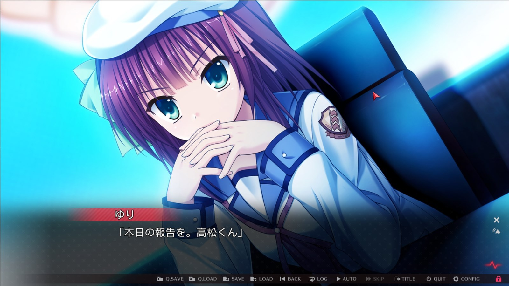

# Visual Novel Guide 

###What are Visual Novels?

Visual Novels (often abbreviated as **VN**) can be described as sort of a mix of a novel and a game, they feature a text-based storyline and only little interaction of the player. Most VNs have anime-like sprites and visuals, and are usually accompanied by voice acting, background music and sound effects. Throughout the game, the player may be given choices, which will have an effect on how the story will play out, so if you play it a second time, with different choices, you may get an entirely different plot.

###Why Visual Novels?
Reading Japanese is extremely important, but not everyone loves reading books, I am definitely one of them. I hate reading books, it’s way too often I get bored when reading a regular, text-only novel. I’m not much of a reader in English either. Oddly enough, I can read visual novels for hours without feeling fatigued. VNs have a mix of literary prose and conversational Japanese, so it’s perfect for reading immersion.
For the people that hate reading, and even find manga boring, VNs might just be perfect for you.

###Finding and downloading VNs (Windows)
*If you have a macOS or Linux computer, then you may have luck using WINE or Winapps.*

Here at TheMoeWay™, we believe paying for anything is stupid. So in the [Discord](https://discord.gg/PxPaMC7CdQ) you can find where to get visual novels for free. 
If you can’t find the visual novel you want in Japanese using the free resources, your last resort *may* be Steam, DMM, or Getchu, but most of the time, this is not the case- I can find almost everything I want using the free resources found in the [Discord](https://discord.gg/PxPaMC7CdQ)

### Installing VNs (Windows)
Most of the time, the VN you downloaded would be in .ISO format, if not, then it’s in .MDS/.MDF format. To mount an .ISO, just double click it, and run the setup files (usually Setup.exe, or Autorun.exe) to proceed with the installation. .MDS/.MDF format VNs require something called WinCDEmu, you can get that [here](https://wincdemu.sysprogs.org/download/)

After you have installed WinCDEmu, you should be able to mount it.

Now, take time and follow the picture instructions I made for you. This will give you a general guide on how to install most visual novels.

### Sample VN Install (Windows)

### Setting Japanese locale (Windows)
Most VNs will not work without Japanese locale. This does NOT mean language and/or region.

Follow the steps below to change the locale of your Windows system to Japanese.

1. Open the Run dialog box using *Windows Key+R*
2. Type “intl.cpl” and hit enter.
3. Under the Administrative tab, go to Change System Locale and select Japanese (Japan)
4. Reboot your PC to apply the changes.

### VNs on mobile (Android)
There are a couple of native Android Visual Novels but these are usually side stories/spin-offs.

The best option is to use PPSSPP emulator and download PSP ROMs from CDRomance or Itazuraneko (Linked in [Discord](https://discord.gg/PxPaMC7CdQ))

This is possible on iOS too, but it’s much more difficult to get PPSSPP running and not revoke without a jailbreak.

### Looking up words in VNs using Yomichan and Textractor

[Download Textractor (preferably the zip version)](https://github.com/Artikash/Textractor/releases)

[Get Yomichan](https://foosoft.net/projects/yomichan/)

[Get Clipboard Inserter](https://github.com/kmltml/clipboard-inserter)

[Texthooking Page](https://texthookerclipboard.netlify.app/html/line_count.html)

A detailed Yomichan setup tutorial can be found in [Monolingual Guide](/monolingual)

For most applications, use the x86 version of Textractor.

Launch a VN and attach Textractor to it using the “Attach to game” function.

Advance the text (click) in the visual novel, and cycle through the hooks until you find the one that matches the text in the game.

Navigate to the *Texthooking page*, and toggle the clipboard inserter.

Now that you have it all set up, enjoy the reading!!

You can keep track of how many characters you read using the indicator in the top-right of the Texthooking page. Bookmark the Texthooking page for good measure!

### Use a walkthrough!
Playing a VN with a walkthrough is usually better than playing without one, because we wouldn’t want to get a bad ending.

You can find walkthroughs by searching “<vn name> 攻略” e.g. “Angel Beats! -1st Beat- 攻略”.

Have fun reading!

Consider joining our **Reading Club** in the [Discord](https://discord.gg/PxPaMC7CdQ)!

### Bonus: Using Textractor for PPSSPP Visual Novels
Hooking PPSSPP Visual Novels require you to use the x86 (32-bit) version of PPSSPP along with the x86 version of Textractor.
1. Launch PPSSPP (32-bit)
2. Launch the Visual Novel (can be found at CDRomance or Itazuraneko in #resources )
3. Attach Textractor (x86) to PPSSPP (32-bit)
4. Advance the text in the VN (O button)
5. Using the "Search for hooks" feature, select "search for specific text"
6. Search for the specific text that is on the PPSSPP VN. It needs to be **exact.**
7. It will take a while to search for the hook, your emulator may start to lag for a while.
8. If Textractor asks, (keep an eye on the Console) frantically advance the text (O button) on the PPSSPP VN.
9. Now it will have found the hook.
10. Advance the text once more (O button)
11. Cycle through the hooks to see which hook has the newly advanced text. 
12. That's it! :tada: You could save the hook to make the process more convenient later.

Proof of texthooking working with PPSSPP:

