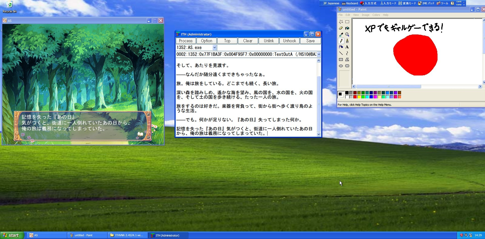

# Visual Novel Guide 

###What are Visual Novels?

Visual Novels (often abbreviated as **VN**) can be described as sort of a mix of a novel and a game, they feature a text-based storyline and only little interaction of the player. Most VNs have anime-like sprites and visuals, and are usually accompanied by voice acting, background music and sound effects. Throughout the game, the player may be given choices, which will have an effect on how the story will play out, so if you play it a second time, with different choices, you may get an entirely different plot.

###Why Visual Novels?
Reading Japanese is extremely important, but not everyone loves reading books, I am definitely one of them. I hate reading books, it’s way too often I get bored when reading a regular, text-only novel. I’m not much of a reader in English either. Oddly enough, I can read visual novels for hours without feeling fatigued. VNs have a mix of literary prose and conversational Japanese, so it’s perfect for reading immersion.
For the people that hate reading, and even find manga boring, VNs might just be perfect for you.

[*Click here to view image from the based department.*](img/vnbased1.png)

###Finding and downloading VNs (Windows)
*If you have a macOS or Linux computer, then you may have luck using WINE or Winapps.*

Getting Japanese visual novels legally isn't as easy as it seems, DLSite is inaccesible in many countries and publishers often choose to omit Japanese from their Steam releases, and even if you are able to get the visual novel legally in Japanese, the import cost and time just isn't worth it.  
So in the [Discord](https://discord.gg/nhqjydaR8j) you can find where to get visual novels for free.  

### Installing VNs (Windows)
Most of the time, the VN you downloaded would be in .ISO format, if not, then it’s in .MDS/.MDF format. To mount an .ISO, just double click it, and run the setup files (usually Setup.exe, or Autorun.exe) to proceed with the installation. .MDS/.MDF format VNs require something called WinCDEmu, you can get that [here](https://wincdemu.sysprogs.org/download/)

After you have installed WinCDEmu, you should be able to mount it.

Now, take time and follow the picture instructions I made for you. This will give you a general guide on how to install most visual novels.

### Sample VN Install (Windows)

### Setting Japanese locale (Windows)
Most VNs will not work without Japanese locale. This does NOT mean language and/or region.

Follow the steps below to change the locale of your Windows system to Japanese.

1. Open the Run dialog box using *Windows Key+R*
2. Type “intl.cpl” and hit enter.
3. Under the Administrative tab, go to Change System Locale and select Japanese (Japan)
4. Reboot your PC to apply the changes.

### VNs on mobile
#### Android
There are a couple of native Android Visual Novels but these are usually side stories/spin-offs.  

The best option is to use [PPSSPP](https://play.google.com/store/apps/details?id=org.ppsspp.ppsspp&hl=ja&gl=US) emulator and download PSP ROMs.

  

#### iOS (Non-jailbreak)

Again, there *are* in fact native iOS visual novels, but I feel like emulating PSP visual novels is a better idea.

It is a little more tricky to get PPSSPP working on iOS without a jailbreak, but it is definitely possible.  
You will need:  
[AltStore](https://altstore.io/) - check the [FAQ](https://altstore.io/faq/) on the website for instructions  
[PPSSPP IPA](https://build.ppsspp.org/builds/iOS/ppssppbuildbot-org.ppsspp.ppsspp-dev-working-ios.ipa)

#### iOS (Jailbreak)

PPSSPP can be installed via Cydia package by adding the repository: `https://cydia.ppsspp.org/`.

### Looking up words in VNs using Yomichan and Textractor

Requirements:

[Download Textractor (preferably the zip version)](https://github.com/Artikash/Textractor/releases)  
[Get Yomichan](https://foosoft.net/projects/yomichan/)  
[Get Clipboard Inserter](https://github.com/kmltml/clipboard-inserter)  
[NEW Texthooking Page (with accurate character count)](https://learnjapanese.moe/texthooker.html)  

A detailed Yomichan setup tutorial can be found [here](/yomichan)

For most applications, use the x86 executable of Textractor.

Launch a VN and attach Textractor to it using the “Attach to game” function.

Advance the text (click) in the visual novel, and cycle through the hooks until you find the one that matches the text in the game.

Navigate to the *Texthooking page*, and toggle the clipboard inserter.

Now that you have it all set up, enjoy the reading!!

You can keep track of how many characters you read using the indicator in the top-right of the Texthooking page. Bookmark the Texthooking page for good measure!

### Use a walkthrough!
Playing a VN with a walkthrough is usually better than playing without one, because we wouldn’t want to get a bad ending.

You can find walkthroughs by searching “<vn name> 攻略” e.g. “Angel Beats! -1st Beat- 攻略”.

### Unsure what to play?

Have a look at visual novel lists ordered by difficulty below

[jamal's list](https://anacreondjt.gitlab.io/vn-chart/)  
[This infamous list](https://docs.google.com/document/u/1/d/1KnyyDt7jimEz-dgeMSKymRaT2r3QKBPm9AzqZ6oUWAs/pub)  
[Dinuz's list](/dinuzlist)  

Have fun reading!

Consider joining our **Reading Club** in the [Discord](https://discord.gg/nhqjydaR8j)!

### Bonus: Using Textractor for PPSSPP Visual Novels
Hooking PPSSPP Visual Novels require you to use the x86 (32-bit) version of PPSSPP along with the x86 version of Textractor.  
1. Launch PPSSPP (32-bit)  
2. Launch the Visual Novel.  
3. Attach Textractor (x86) to PPSSPP (32-bit)  
4. Advance the text in the VN (O button)  
5. Using the "Search for hooks" feature, select "search for specific text"  
6. Search for the specific text that is on the PPSSPP VN. It needs to be **exact.**  
7. It will take a while to search for the hook, your emulator may start to lag for a while.  
8. If Textractor asks, (keep an eye on the Console) frantically advance the text (O button) on the PPSSPP VN.  
9. Now it will have found the hook.  
10. Advance the text once more (O button)  
11. Cycle through the hooks to see which hook has the newly advanced text.   
12. That's it! :tada: You could save the hook to make the process more convenient later.  

Proof of texthooking working with PPSSPP:  
  
  

### Bonus #2: Visuals Novels on a Windows XP virtual machine
#### Why?

Some legacy visual novels won't run on newer versions of Windows even with compatibility settings, and thus you need to use Windows XP to play them.  Windows XP does not run on modern hardware, so you will need to make use of [Virtual Machines](https://en.wikipedia.org/wiki/Virtual_machine)

#### Requirements
	
Oracle VM VirtualBox [(Link)](https://www.virtualbox.org/wiki/Downloads)  

Windows XP Professional SP3 Disc Image (.ISO) (Will not be provided here due to copyright, contact me at the Discord)  

At least 4GB RAM (Recommended)  

At least 30GB free disk space. (Recommended) 

Virtualization technology enabled in your BIOS. (Highly Recommended, you can search on Google how to do this for your computer.)  

#### Full Setup

Here I'll walk you through the entire process. From installing Windows XP to getting a VN hooked and working.

1. Install Oracle VM VirtualBox  
2. Acquire a disc image for Windows XP Professional SP3  
3. Open Oracle VM Virtual Box, at the top, click the blue "New" button.  
4. You can set any name you wish.  
5. Make the "Type" `Microsoft Windows` and the "Version" `Windows XP (32-bit)`. Click next.   
6. For the memory size, make it at least `768` MB. Click next.  
7. Keep on clicking next until you reach the "File location and size". Over here you'd want to set the size of the virtual hard disk to `30.00 GB`. Now click Create.  
8. Now double click the virtual machine that has now appeared in the left menu to run the virtual machine.    
9. In the "Select start-up disk" dialog box, click the little folder icon, and then click "Add".  
10. Navigate to the disc image (.ISO) for Windows XP Professional SP3, open it and then click "Choose".  
11. Now click "Start" and wait for Windows XP to boot into the installation.  
12. You will be greeted with a blue installation screen. Don't worry. Just keep hitting the `Enter ⏎` key.  
13. When the initial setup is complete, Windows XP will boot into another installation screen. Wait it out.  
14. Before installation finishes, it will ask for your name, computer name, password. Just do whatever. I put "shoui" for every field. You will be asked to set a time zone too, do Tokyo because some VNs actually check for Japanese timezone.
15. Once it finishes installation and reboots, you will be greeted with Windows XP setup. Enjoy the music!  
16. Click Next, then Yes, then Next, then No, then Next, then No, then put your name, then Finish.  
17. Wait until Windows XP boots into the desktop. Nostalgic isn't it?  
18. Turn off your Windows XP virtual machine. (Alt F4 > Turn Off)  
19. We will now increase the specs of your VM. Click on the VM on the left menu, then click the orange "Settings" button.  
20. Go in System > Processor, and increase the CPU core count to whatever is on the green bar. For me it's `2` CPUs. I don't really understand what PAE/NX is but enable that anyway.  
21. Now go in Display and enable 3D acceleration and set video memory to `128 MB`
22. Now launch your VM again by double clicking it in the left menu.
23. Once you are in the XP desktop. On the VirtualBox window, click "Devices" and then click on "Insert Guest Addons CD Image"  
24. It will now autorun VBox Guest Additions setup, install it and reboot your VM. Go in Devices again and set Drag and Drop to Bidirectional. This will allow us to drag and drop files from our actual PC to our VM.  
25. Now we will enable Japanese locale. Again in "Devices", click on Optical Drives > select the disc image you used to install Windows XP. Exit setup when prompted.  
26. Now open a Run dialog box, by doing `Win+R`, and enter `intl.cpl`. Go in the `Languages` tab and check "Install files for East Asian languages" now hit Apply. Do not reboot yet.   
27. Go in the Regional Options tab and set format to Japanese and location to Japan. Hit Apply.  
28. Now go in the Advanced tab and set "Language for non-Unicode programs" to Japanese. Hit Apply. Now reboot your VM when prompted.  
29. Now go and install some software. I recommend you download these on your actual PC and just drag and drop it into your VM.  
		[7-Zip (32 bit)](https://www.7-zip.org/a/7z1900.exe)  	
		[Mozilla Firefox 52.9.0 ESR](https://ftp.mozilla.org/pub/firefox/releases/52.9.0esr/win32/en-US/Firefox%20Setup%2052.9.0esr.exe)  - Most recent browser that supports XP.  
		[ITHVNR](https://cdn.discordapp.com/attachments/715225470798659667/799731133683728404/ITHVNR-3.4524.1-win32.7z) - because Textractor is not supported on XP. Install vcredist_x86 to make it work.  
		[MacType](https://github.com/snowie2000/mactype/releases/download/2019.1-beta6/MacTypeInstaller_2019.1-beta6.exe) - Fix pixelated CJK font. Also recommend on Win10. Use registry mode. :slight_smile:  
		[Avast Antivirus](https://www.avast.com/) - I know it's kind of a meme but since you are using Windows XP, and it's connected to the internet, consider yourself vulnerable. If you are paranoid then you should install this antivirus.  
30. In "Devices" enable bidirectional clipboard.
31. Download your visual novel of choice and drag and drop it to your VM. If it needs to be installed, then install it.
32. Open ITHVNR and your VN. In ITHVNR, go in "Process", find the process of the VN, then click "Attach" and "OK"
33. Advance some text in the VN. Now cycle through the hooks in ITHVNR and find the right hook.
34. ITHVNR will automatically copy text to your clipboard, which is shared with your actual PC. I recommend you use [Yomichan](/yomichan)'s clipboard monitor :)
35. Phew, that's pretty much it, have fun!

  
*from actual pc*

:smirk_cat:

### Bonus #3: Visual Novels on Linux (WINE)

kamui-7's vn guide for linux [[link]](https://gist.github.com/kamui-7/3ea1d2cc953f0f213f559e5293a6144a)

### Bonus #4: Visual Novels on macOS

*Supporters only. (coming soon)*