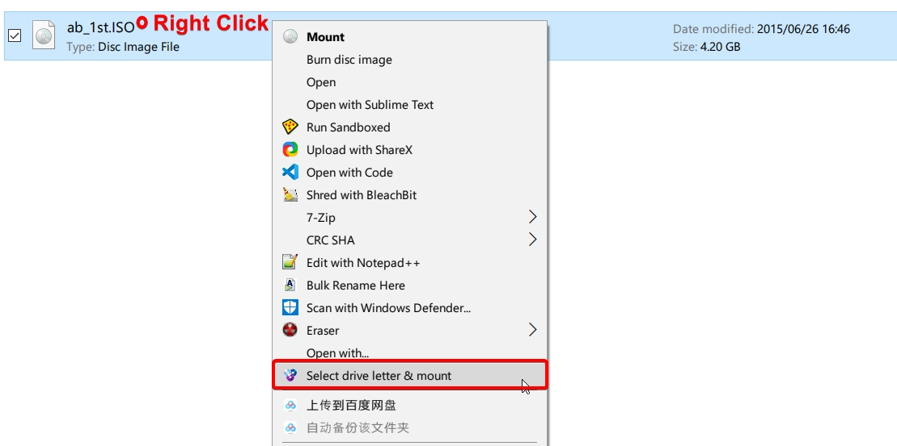
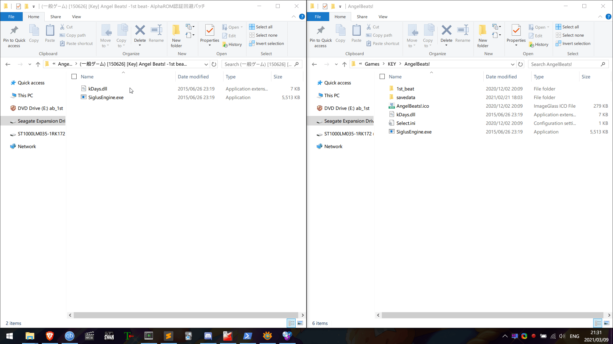

# Cross Platform Visual Novel Setup 

This page will go over how to set up visual novels on all platforms.  

# Getting Visual Novels

Check out the [Resources](/resources/#the-following-may-be-nsfw) page to find where to get Visual novels.

Visual novels for Microsoft Windows are distributed commonly in disc image files. Usually in .ISO and sometimes .MDF/.MDS files, they must first be mounted before you run the installer and then you will be able to play the game.  

!!! question "Glossary: disc image file"
	A disc image file does not refer to a picture of a disc, rather it is a file (usually `.iso`) that contains an exact copy of what was on a disc. Remember: Japanese visual novels are sold on optical discs, and then people make an exact copy of what is on the disc onto an `.iso` or `.mdf/.mds` file.

# Desktop 

## Microsoft Windows (7 - 10)

Visual novels are always Microsoft Windows applications. If you have a Windows PC, you will always be able to run visual novels as long as your visual novels supports the Windows version you are running. For most VNs out there, Windows 7 is a minimum, older titles will also work on XP. Newer titles released around 2018 will require Windows 8.1 as a minimum.  

### Step 1. Setting Japanese Locale

Japanese visual novels will not run without Japanese locale. You may use a locale emulator, though it is less of a hassle to just change system-wide locale in my opinion.
Follow the steps below to set Japanese locale on your Windows system.  

1. Open the Run dialog box using *Windows Key+R*
2. Type `intl.cpl` and hit enter.
3. Click on the Administrative tab, go to Change System Locale and select Japanese (Japan) and click OK.
4. Reboot your PC to apply the changes.

### Step 2. Extracting archives and mounting images

Requirements:  
[Get 7-Zip](https://www.7-zip.org/)  
[Get WinCDEmu](https://wincdemu.sysprogs.org/download/)  

!!! info "Alternatives"
	I am aware of alternatives such as DAEMON Tools as an alternative for WinCDEmu and WinRAR as an alternative for 7-Zip. However, I would **rather not** use crappy software. #FOSS

We will be using 2 pieces of software today, *7-Zip* which is a tool for making and extracting archives such as `.zip` , `.tar` and `.7z` files, and *WinCDEmu* which allows us to mount image files such as `.mds/.mdf`, `.iso`.  

	
If you have downloaded a visual novel, and it came in a .rar/.zip/.7z archive, you must extract it before you can mount the installation files. You can use 7-Zip for this. 

> Right click the archive > 7-Zip > Extract to %folder%

Above is an example of extracting the archive using 7-Zip.  

After the archive has been extracted, we will now use WinCDEmu to mount the image that has been extracted from it.  

> Right click the image > Select drive letter & mount > OK

  

After that,

  

The disc image is now mounted. You should see a new volume appear on your Explorer sidebar.

  

!!! info ".MDS/.MDF files"
	It is a little different if you have .MDS/.MDF files, see below.  

Click on the new volume that appeared on your sidebar and run the installer. See below for details.  

  

Proceed with the installation, you may want to take note of where you installed the game. I installed Angel Beats! into `D:\Games\KEY\AngelBeats!`

If your visual novel came with a crack, you will need to apply this crack before you are able to launch the game. Cracks often come in the form of a .exe/.dll file found in folders/archives called "AlphaROM" or  "NoDVD" or simply just "Patch" or "Crack", whatever it may be, copy these files into the installation directory of the game.  

You can find an example below. Sorry for the "awkward" cursor placement, it happens in the recording for some reason.  

  

After that, you should just be able to launch the game! 

Now go back to [Visual Novel Guide](/vn) if you need help with texthooking and Yomichan. 

## macOS

### Using a virtual machine (10.11-11.x)

TBA 

### Bootcamp Assistant (Intel(R) branded processors)

TBA

### Wine (10.8-11.x)  

TBA

## GNU/Linux

TBA

### Wine

TBA

## BSD (FreeBSD)

TBA

### Wine

TBA

# Mobile

## Android

TBA

### Using PPSSSPP Emulator

TBA

### Running Microsoft Windows in QEMU

TBA

## iOS

TBA

### Non-jailbreak: Using PPSSPP Emulator

TBA

### Jailbreak: Using PPSSPP Emulator

TBA

## Emulators

TBA

# Legacy

TBA

## Windows XP Virtual Machine

TBA

## MS-DOS

TBA

## PC-98

