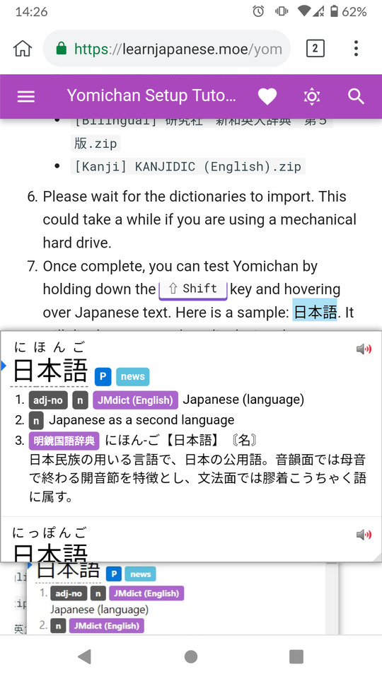

# Yomichan Setup Tutorial

## What is Yomichan?
Yomichan is a browser extension that allows you to look up Japanese words with both the meaning and the reading on web pages with ease.  

## Getting Started 
Yomichan is available for both Chromium and Firefox based browsers. You can find the respective versions below.  
[Chrome Web Store](https://chrome.google.com/webstore/detail/yomichan/ogmnaimimemjmbakcfefmnahgdfhfami)  
[Firefox Add-Ons](https://addons.mozilla.org/en-US/firefox/addon/yomichan/)  
Once installed, it will open a new tab page, just close it for now so we don't confuse each other.  

## Acquiring Dictionaries
When you first install Yomichan, you need to load dictionaries into it in order to use it.  
These files use the `.zip` extension and **are not to be extracted by the user.**

You can find my collection of Yomichan dictionaries below. This will have everything you need and (probably) don't need. :slight_smile:  
→→→→[Shoui's Yomichan Dictionary Collection](https://learnjapanese.link/dictionaries)←←←←　　    

Dictionaries can be found in their respective folders.  
I recommend you install the following dictionaries:  
	- `Bilingual/[Bilingual] JMdict (English).zip`  
	- `Bilingual/[Bilingual] 新和英.zip`  
	- `Kanji/[Kanji] KANJIDIC (English).zip`  
	- `Grammar/Dictionary of Japanese Grammar.zip` 

## Installing dictionaries and basic usage
  
1. Click on the  icon in the browser toolbar.  
2. Click on the  icon to access the settings page.  
3. On the left sidebar, click on "Dictionaries" and then click on "Configure installed and enabled dictionaries…"  
4. Click the "Import" button on the bottom.  
5. Here's where you select the dictionaries to import. Please only import the following. 
	- `[Bilingual] JMdict (English).zip`
	- `[Bilingual] 新和英.zip`
	- `[Kanji] KANJIDIC (English).zip`
	- `Grammar/Dictionary of Japanese Grammar.zip` 

6. Please wait for the dictionaries to import. This could take a while.
7. Once complete, you can test Yomichan by holding down the ++shift++ key and hovering over Japanese text. Here is a sample: 日本語. It will display a pop up box displaying the definitions separated by dictionary.  

 

Click anywhere outside of the box or press the ++esc++ key to dismiss.
Click on an individual kanji in the headword to view kanji information (only functional with KANJIDIC installed).

You can click the  button to hear the word being pronounced by a native speaker.

In your browser extensions toolbar, if you click on the Yomichan logo, then on the  icon or by using the ++alt+insert++ keyboard shortcut, you can access Yomichan Search, this is where you can use Yomichan as a standalone Japanese to English dictionary. 

Pop up box size can be edited with advanced settings enabled.  
A full dark mode can be enabled in the settings too.  

**JMdict** is the dictionary hosted on Jisho.org. Jisho.org is not its own dictionary, rather it's a portal that accesses JMdict. This is the most common Japanese to English dictionary.  

**新和英** (Shinwaei) is a Japanese-English dictionary intended for Japanese people. It has many example sentences which can prove to be very useful for Japanese learners. A variation of this with even more example sentences is called `[Bilingual] 研究社　新和英大辞典　第５版.zip` can also be found in my dictionaries collection.  

**KANJIDIC** is a kanji dictionary, it allows you to view information of individual kanji.  

**Dictionary of Japanese Grammar**, or 日本語文法辞典(全集), is a dictionary that helps you look up grammar (duh!).  

## Recommended frequency dictionaries  

Yomichan supports the use of frequency dictionaries that tell you how common a word is.  

**JPDB** - A frequency list made from jpdb.io, which is a site that has analyzed many light novels, visual novels, anime and j-drama. In turn, this is a frequency list from Japanese fictional media.  

**CC100** - Frequency list of corpus data from Japanese internet. Formal words will appear more common in this frequency list . Example: 審議会 (council) is 9733 frequency on CC100 and 58730 on JPDB.  

**fWhat is a common word?**  

Very common: 1-10,000  
Commmon: 10,001-20,000    
Fairly common: 20,001-30,000 
Kind of uncommon: 30,001-40,000 
Uncommon: 40,001-50,000
Rare: 50,001-80,000
Natives-probably-don't-know-it-level: 80,000+

## Allowing access to file URLs

Enabling this allows you to use Yomichan on local files such as .HTML files.  

!!! failure "PDF Files"
    On Chrome, you need to use [PDF.js](https://mozilla.github.io/pdf.js/web/viewer.html). Click on the diagonal up arrow thingy to load a pdf.  

Chromium:  
	- Right click the   
	- Click "Manage Extensions"  
	- Enable "Allow access to file URLs"  

Firefox:  
	- Enabled by default.  

## Bonus: Adding Forvo extra audio source  

You may encounter missing audio with the default Yomichan audio sources, adding [Forvo](https://ja.forvo.com/) will help fill in the gaps.  

Thanks to [jamesnicholas](https://github.com/jamesnicolas/yomichan-forvo-server) for this wonderful add-on!

This requires you to have Anki (2.1 and newer) installed and open on your computer to work.  

1. Copy this code `580654285`
2. In Anki, in the menu at the top, click on **Tools**, then **Add-ons**.
3. In the new window, click **Get Add-ons...** and paste the code `580654285` into the text box and click **OK**
4. Restart Anki by closing it and opening it back up again.
5. In the Yomichan settings page , click **Audio** on the left, and then click on **Configure audio playback sources...**
6. Click **Add** and then select **Custom** from the drop down menu. 
7. Now where it says **Custom audio source (?)**, select the type **JSON** from the drop down menu.
8. In the URL text box, enter this `http://localhost:8770/?expression={expression}&reading={reading}`

## Bonus: Android use with Kiwi Browser  

Kiwi Browser is a Chromium browser that supports extensions, including Yomichan. You can download it below.  
[Google Play](https://play.google.com/store/apps/details?id=com.kiwibrowser.browser)  
 
You can access the Yomichan settings page by going in :material-dots-vertical: > Yomichan	 > Settings.  

Please see above for link to download the extension, link to the dictionaries collection and recommended starter dictionaries.  
Importing a dictionary is a very processor intensive process and will take a long time depending on your phone. Please be patient.  

Tap on a word to look it up. In the case that it is not working, you may need to turn off the modifier key.  

  

## Anki Setup

See [AnimeCards Site](https://animecards.site/)

## Offline audio server (+ More audios than default)  

[Follow this guide to get local audio.](https://github.com/themoeway/local-audio-yomichan)  

<h3>Found this useful? Consider supporting me on Patreon!</h3>   

[:fontawesome-brands-patreon: Support me on Patreon](https://www.patreon.com/shoui){: .md-button }
